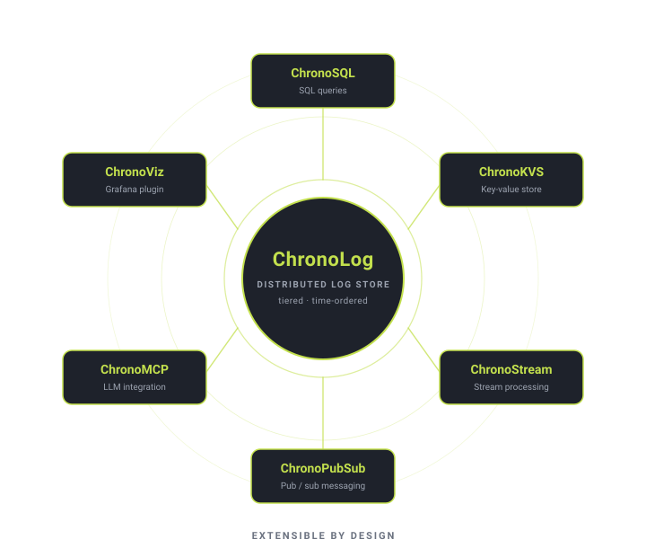

> [!IMPORTANT]
> **ChronoLog v3.0.0 is now available.**
> The latest stable release, focused on API completeness and native extension plugins.
> [Releases on chronolog.dev](https://www.chronolog.dev/releases) · [Release notes](https://github.com/grc-iit/ChronoLog/releases/latest) · [All releases on GitHub](https://github.com/grc-iit/ChronoLog/releases) · [Documentation](https://www.chronolog.dev/docs)

<p align="center">
  <a href="https://www.chronolog.dev">
    
  </a>
</p>

<h1 align="center">ChronoLog</h1>

<p align="center"><strong>Distributed Shared Tiered Log Store</strong></p>

<p align="center">A distributed and tiered shared log storage ecosystem that uses physical time to distribute log entries while providing total log ordering.</p>

<p align="center">
  <a href="LICENSE"></a>
  <a href="https://github.com/grc-iit/ChronoLog"></a>
  <a href="https://grc.iit.edu/"></a>
  <a href="https://www.chronolog.dev"></a>
  <a href="https://github.com/grc-iit/ChronoLog/issues"></a>
  <a href="https://github.com/grc-iit/ChronoLog/releases/latest"></a>
</p>

<p align="center">
  <a href="https://www.chronolog.dev"><strong>Website</strong></a>
  &nbsp;·&nbsp;
  <a href="https://www.chronolog.dev/docs/getting-started/overview"><strong>Documentation</strong></a>
  &nbsp;·&nbsp;
  <a href="https://github.com/grc-iit/ChronoLog/releases">Releases</a>
  &nbsp;·&nbsp;
  <a href="https://github.com/grc-iit/ChronoLog/issues">Issues</a>
</p>

## Overview

**ChronoLog** is a distributed, tiered shared log store with time-based event ordering. It uses physical time for data distribution and multiple storage tiers for elastic capacity, eliminating the need for a central sequencer while keeping ingestion and query paths independently scalable.

A pluggable serving layer lets custom services run directly on the log. Shipping plugins cover SQL-like queries, key-value storage, streaming, pub/sub, Grafana visualization, and an MCP server for LLM integration.

<p align="center">
  
</p>

### Key Features

- **No central sequencer**: physical-time partitioning enables high-throughput parallel writes.
- **Tiered storage**: StoryChunks flow across fast and capacity tiers automatically.
- **Concurrent access at scale**: multi-writer, multi-reader over RDMA or TCP.
- **Pluggable serving layer**: extend the log with custom query and streaming services.

For more, visit [chronolog.dev](https://www.chronolog.dev).

<!--
## Wiki:
Learn more detailed information about the project on ChronoLog's Wiki: https://github.com/grc-iit/ChronoLog/wiki/

## Main publication

<div style="border: 1px solid #555555; padding: 10px; border-radius: 5px; background-color: #888888;">
  <p style="font-size: 1.2em; margin: 0;">
    A. Kougkas, H. Devarajan, K. Bateman, J. Cernuda, N. Rajesh, X.-H. Sun. 
    <a href="http://www.cs.iit.edu/~scs/testing/scs_website/assets/files/kougkas2020chronolog.pdf" target="_blank">
      <strong>"ChronoLog: A Distributed Shared Tiered Log Store with Time-based Data Ordering"</strong>
    </a>, 
    Proceedings of the 36th International Conference on Massive Storage Systems and Technology (MSST 2020).
  </p>
</div>
-->

## Installation

ChronoLog ships in five flavors. Pick the one that matches your environment. The full step-by-step guide for every method (including configuration, single-node and multi-node deployment) lives in the [Quick Start guide on chronolog.dev](https://www.chronolog.dev/docs/getting-started/quick-start).

<details>
<summary><strong>Release archive (tarball)</strong>: pre-built binaries, no toolchain required</summary>

Best for trying ChronoLog quickly on a Linux x86_64 host.

Download the tarball:

```bash
wget https://github.com/grc-iit/ChronoLog/releases/latest/download/chronolog-linux-x86_64.tar.gz
```

Extract it:

```bash
tar -xzf chronolog-linux-x86_64.tar.gz
```

Full guide → [Quick Start: Release Archive](https://www.chronolog.dev/docs/getting-started/quick-start)

</details>

<details>
<summary><strong>DEB package</strong>: Debian / Ubuntu</summary>

System-wide install via `apt` for Debian, Ubuntu, and compatible distributions.

```bash
sudo apt install ./chronolog-linux-x86_64.deb
```

Full guide → [Quick Start: DEB Package](https://www.chronolog.dev/docs/getting-started/quick-start)

</details>

<details>
<summary><strong>RPM package</strong>: RHEL / Fedora / Rocky / Alma</summary>

System-wide install via `dnf` (or `yum`) for RHEL-family distributions.

```bash
sudo dnf install ./chronolog-linux-x86_64.rpm
```

Full guide → [Quick Start: RPM Package](https://www.chronolog.dev/docs/getting-started/quick-start)

</details>

<details>
<summary><strong>Docker</strong>: containerized, single- or multi-node</summary>

Containerized deployment with ChronoLog pre-installed.

Pull the image:

```bash
docker pull ghcr.io/grc-iit/chronolog:latest
```

Run a container:

```bash
docker run -it --rm ghcr.io/grc-iit/chronolog:latest bash
```

Full guide → [Quick Start: Docker](https://www.chronolog.dev/docs/getting-started/quick-start) · [Single-node tutorial](https://www.chronolog.dev/docs/tutorials/docker-single-node/running-chronolog) · [Multi-node tutorial](https://www.chronolog.dev/docs/tutorials/docker-multi-node/running-chronolog)

</details>

<details>
<summary><strong>Build from source</strong>: for developers and advanced users</summary>

For modifying ChronoLog, building against a custom dependency set, or targeting a platform without pre-built packages.

Clone the repository:

```bash
git clone https://github.com/grc-iit/ChronoLog.git
```

Enter the repo:

```bash
cd ChronoLog
```

Activate the Spack environment and install dependencies:

```bash
spack env activate -p .
```

```bash
spack install -v
```

Configure, build, and install:

```bash
mkdir build && cd build
```

```bash
cmake -DCMAKE_BUILD_TYPE=Release ..
```

```bash
make all
```

```bash
make install
```

Full guide → [Quick Start: Build from Source](https://www.chronolog.dev/docs/getting-started/quick-start)

</details>


## Documentation

Full documentation lives at [chronolog.dev/docs](https://www.chronolog.dev/docs/getting-started/overview):

- [Getting Started](https://www.chronolog.dev/docs/getting-started/overview): overview, core concepts, and Quick Start install paths.
- [User Guide](https://www.chronolog.dev/docs/user-guide/overview): architecture, configuration, deployment, and the data model.
- [Tutorials](https://www.chronolog.dev/docs/tutorials/docker-single-node/running-chronolog): step-by-step walkthroughs for single- and multi-node Docker deployments.
- [Contributing](https://www.chronolog.dev/docs/contributing/development/building-for-development): build-for-development setup, code style, and contributor guidelines.

## Research Network

ChronoLog evolves alongside a network of labs and institutions whose research shapes the kinds of workloads and infrastructure our system is designed to support. [Argonne National Laboratory](https://www.anl.gov) and [Lawrence Livermore National Laboratory](https://www.llnl.gov) advance exascale computing, HPC system software, resource management, and large-scale telemetry. The [University of Chicago](https://www.uchicago.edu) leads research on distributed systems and large-scale scientific workflows for cosmology and the physical sciences. The [SCI Institute at the University of Utah](https://www.sci.utah.edu) drives scientific visualization, in-situ analysis, and large-scale data exploration for simulation and instrument science. [Ohio State University](https://www.osu.edu) is a leader in high-performance networking, MPI, and RDMA-based communication. [DePaul University](https://www.depaul.edu) works on data systems, lightweight indexing, and computational provenance. The [Institute for Food Safety and Health (IFSH)](https://www.iit.edu/ifsh) applies high-throughput data analysis, genomics, and bioinformatics to food safety and public-health challenges.

<p align="center">
  <a href="https://www.anl.gov"></a>
  &nbsp;&nbsp;
  <a href="https://www.llnl.gov"></a>
  &nbsp;&nbsp;
  <a href="https://www.uchicago.edu"></a>
  &nbsp;&nbsp;
  <a href="https://www.sci.utah.edu"></a>
  &nbsp;&nbsp;
  <a href="https://www.osu.edu"></a>
  &nbsp;&nbsp;
  <a href="https://www.depaul.edu"></a>
  &nbsp;&nbsp;
  <a href="https://www.iit.edu/ifsh"></a>
</p>

> **Interested in integrating ChronoLog into your research or systems?** We welcome conversations with labs, research groups, and engineering teams working on scalable event processing, large-scale telemetry, time-ordered storage, and related problems. Reach out via [GitHub Issues](https://github.com/grc-iit/ChronoLog/issues) or contact the [Gnosis Research Center](https://grc.iit.edu).

<br>

---

<br>

<div align="center">


**Gnosis Research Center**  
Illinois Institute of Technology  
*Advancing the Future of Scalable Computing and Data-Driven Discovery*

**Connect with us:**  
🌐 [Website](https://grc.iit.edu) • 🐦 [X (Twitter)](https://twitter.com/grc_iit) • 💼 [LinkedIn](https://www.linkedin.com/school/gnosis-research-center) • 📺 [YouTube](https://www.youtube.com/@grc_iit) • ✉️ [Email](mailto:grc@illinoistech.edu)
</div>
<br>
<p align="center">
  <strong>Sponsored by:</strong><br>
  <a href="https://www.nsf.gov"></a><br>
  National Science Foundation (NSF CSSI-2104013)
</p>