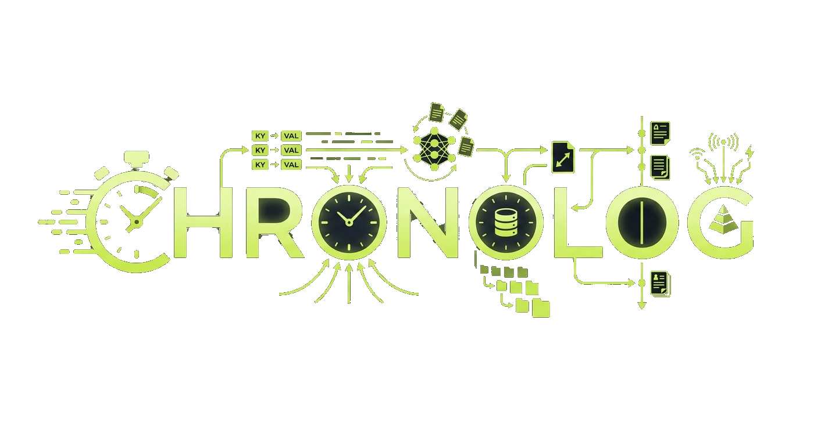

> [!IMPORTANT]
> **ChronoLog MCP is now available.**
> Integrate ChronoLog directly with LLMs through our new MCP server for real-time logging, event processing, and structured interactions.  
> [Code](https://github.com/iowarp/agent-toolkit/tree/main/agent-toolkit-mcp-servers/chronolog) - [Documentation](https://www.iowarp.ai/docs/agent-toolkit/mcp#system-monitoring-2-servers-14-tools)

<p align="center">
  <a href="https://www.chronolog.dev">
    
  </a>
</p>

<h1 align="center">ChronoLog</h1>

<p align="center"><strong>Distributed Shared Tiered Log Store</strong></p>

<p align="center">A distributed and tiered shared log storage ecosystem that uses physical time to distribute log entries while providing total log ordering.</p>

<p align="center">
  <a href="LICENSE"></a>
  <a href="https://github.com/grc-iit/ChronoLog"></a>
  <a href="https://grc.iit.edu/"></a>
  <a href="https://www.chronolog.dev"></a>
  <a href="https://github.com/grc-iit/ChronoLog/issues"></a>
  <a href="https://github.com/grc-iit/ChronoLog/releases/latest"></a>
</p>

## Overview

**ChronoLog** is a distributed, tiered shared log store with time-based event ordering. It uses physical time for data distribution and multiple storage tiers for elastic capacity, eliminating the need for a central sequencer while keeping ingestion and query paths independently scalable.

A pluggable serving layer lets custom services run directly on the log. Shipping plugins cover SQL-like queries, key-value storage, streaming, pub/sub, Grafana visualization, and an MCP server for LLM integration.

### Key Features

- **No central sequencer**: physical-time partitioning enables high-throughput parallel writes.
- **Tiered storage**: StoryChunks flow across fast and capacity tiers automatically.
- **Concurrent access at scale**: multi-writer, multi-reader over RDMA or TCP.
- **Pluggable serving layer**: extend the log with custom query and streaming services.

For more, visit [chronolog.dev](https://www.chronolog.dev).

<!--
## Wiki:
Learn more detailed information about the project on ChronoLog's Wiki: https://github.com/grc-iit/ChronoLog/wiki/

## Main publication

<div style="border: 1px solid #555555; padding: 10px; border-radius: 5px; background-color: #888888;">
  <p style="font-size: 1.2em; margin: 0;">
    A. Kougkas, H. Devarajan, K. Bateman, J. Cernuda, N. Rajesh, X.-H. Sun. 
    <a href="http://www.cs.iit.edu/~scs/testing/scs_website/assets/files/kougkas2020chronolog.pdf" target="_blank">
      <strong>"ChronoLog: A Distributed Shared Tiered Log Store with Time-based Data Ordering"</strong>
    </a>, 
    Proceedings of the 36th International Conference on Massive Storage Systems and Technology (MSST 2020).
  </p>
</div>
-->

## Installation

ChronoLog ships in five flavors. Pick the one that matches your environment. The full step-by-step guide for every method (including configuration, single-node and multi-node deployment) lives in the [Quick Start guide on chronolog.dev](https://www.chronolog.dev/docs/getting-started/quick-start).

<details>
<summary><strong>📦 Release archive (tarball)</strong>: pre-built binaries, no toolchain required</summary>

Best for trying ChronoLog quickly on a Linux x86_64 host.

```bash
wget https://github.com/grc-iit/ChronoLog/releases/latest/download/chronolog-linux-x86_64.tar.gz
tar -xzf chronolog-linux-x86_64.tar.gz
```

Full guide → [Quick Start: Release Archive](https://www.chronolog.dev/docs/getting-started/quick-start)

</details>

<details>
<summary><strong>🟧 DEB package</strong>: Debian / Ubuntu</summary>

System-wide install via `apt` for Debian, Ubuntu, and compatible distributions.

```bash
sudo apt install ./chronolog-linux-x86_64.deb
```

Full guide → [Quick Start: DEB Package](https://www.chronolog.dev/docs/getting-started/quick-start)

</details>

<details>
<summary><strong>🟥 RPM package</strong>: RHEL / Fedora / Rocky / Alma</summary>

System-wide install via `dnf` (or `yum`) for RHEL-family distributions.

```bash
sudo dnf install ./chronolog-linux-x86_64.rpm
```

Full guide → [Quick Start: RPM Package](https://www.chronolog.dev/docs/getting-started/quick-start)

</details>

<details>
<summary><strong>🐳 Docker</strong>: containerized, single- or multi-node</summary>

Containerized deployment with ChronoLog pre-installed.

```bash
docker pull ghcr.io/grc-iit/chronolog:latest
docker run -it --rm ghcr.io/grc-iit/chronolog:latest bash
```

Full guide → [Quick Start: Docker](https://www.chronolog.dev/docs/getting-started/quick-start) · [Single-node tutorial](https://www.chronolog.dev/docs/tutorials/docker-single-node/running-chronolog) · [Multi-node tutorial](https://www.chronolog.dev/docs/tutorials/docker-multi-node/running-chronolog)

</details>

<details>
<summary><strong>🛠️ Build from source</strong>: for developers and advanced users</summary>

For modifying ChronoLog, building against a custom dependency set, or targeting a platform without pre-built packages.

```bash
git clone https://github.com/grc-iit/ChronoLog.git && cd ChronoLog
spack env activate -p . && spack install -v
mkdir build && cd build && cmake -DCMAKE_BUILD_TYPE=Release .. && make all && make install
```

Full guide → [Quick Start: Build from Source](https://www.chronolog.dev/docs/getting-started/quick-start)

</details>

## Releases

ChronoLog follows a regular release cadence. Each release bundles a tarball, DEB and RPM packages, a Docker image, and a source archive, all linked from the [GitHub Releases page](https://github.com/grc-iit/ChronoLog/releases).

| Version | Date | Notes |
|---------|------|-------|
| **v2.8.0** | 2026-05-18 | [Release notes](https://github.com/grc-iit/ChronoLog/releases/tag/v2.8.0) |
| v2.7.0 | 2026-04-30 | [Release notes](https://github.com/grc-iit/ChronoLog/releases/tag/v2.7.0) |
| v2.6.0 | 2026-04-24 | [Release notes](https://github.com/grc-iit/ChronoLog/releases/tag/v2.6.0) |

Full history → [github.com/grc-iit/ChronoLog/releases](https://github.com/grc-iit/ChronoLog/releases)


## Documentation

Comprehensive documentation and tutorials are available on our [Wiki](https://github.com/grc-iit/ChronoLog/wiki). The documentation covers everything from getting started to advanced configuration and deployment strategies.

### 📚 Documentation

| Document | Description |
|----------|-------------|
| [Getting Started](https://github.com/grc-iit/ChronoLog/wiki/01.-Getting-Started) | Introduction and first steps with ChronoLog |
| [Installation](https://github.com/grc-iit/ChronoLog/wiki/02.-Installation) | Detailed installation guides and requirements |
| [Configuration](https://github.com/grc-iit/ChronoLog/wiki/03.-Configuration) | Configuration options and settings |
| [Deployment](https://github.com/grc-iit/ChronoLog/wiki/04.-Deployment) | Deployment strategies and best practices |
| [Client API](https://github.com/grc-iit/ChronoLog/wiki/05.-Client-API) | API reference and usage examples |
| [Client Examples](https://github.com/grc-iit/ChronoLog/wiki/06.-Client-Examples) | Code examples and use cases |
| [Architecture](https://github.com/grc-iit/ChronoLog/wiki/07.-Architecture) | System architecture and design principles |
| [Plugins](https://github.com/grc-iit/ChronoLog/wiki/08.-Plugins) | Plugin development and integration |
| [Code Style Guidelines](https://github.com/grc-iit/ChronoLog/wiki/09.-Code-Style-Guidelines) | Coding standards and conventions |
| [Contributors Guidelines](https://github.com/grc-iit/ChronoLog/wiki/10.-Contributors-Guidelines) | Guidelines for contributing to ChronoLog |

### 🎓 Tutorials

| Tutorial | Description |
|----------|-------------|
| [Tutorial 1: First Steps with ChronoLog](https://github.com/grc-iit/ChronoLog/wiki/Tutorial-1:-First-Steps-with-ChronoLog) | Get started with your first ChronoLog deployment |
| [Tutorial 2: How to run a Performance test](https://github.com/grc-iit/ChronoLog/wiki/Tutorial-2:-How-to-run-a-Performance-test) | Learn how to benchmark and test ChronoLog performance |
| [Tutorial 3: Running ChronoLog with Docker (single-node)](https://github.com/grc-iit/ChronoLog/wiki/Tutorial-3:-Running-ChronoLog-with-Docker-(single-node)) | Deploy ChronoLog on a single node using Docker |
| [Tutorial 4: Running ChronoLog with Docker (Multi-Node)](https://github.com/grc-iit/ChronoLog/wiki/Tutorial-4:-Running-ChronoLog-with-Docker-(Multi-node)) | Deploy ChronoLog across multiple nodes using Docker |

## Research Network

ChronoLog evolves alongside a network of labs and institutions whose research in scalable systems, scientific computing, and large-scale data shapes the problems that motivate our work.

<table>
<tbody>
<tr>
<td> <a href="https://www.anl.gov">Argonne National Laboratory</a></td>
<td>National lab advancing exascale computing, distributed workflows, and real-time AI/ML integration for scientific applications.</td>
</tr>
<tr>
<td> <a href="https://www.uchicago.edu">University of Chicago</a></td>
<td>Research community spanning distributed systems, large-scale scientific workflows, and data pipelines for cosmology and the physical sciences.</td>
</tr>
<tr>
<td> <a href="https://www.iit.edu/ifsh">Institute for Food Safety and Health (IFSH)</a></td>
<td>Research center applying high-throughput data analysis, genomics, and bioinformatics to food safety and public-health challenges.</td>
</tr>
<tr>
<td> <a href="https://www.llnl.gov">Lawrence Livermore National Laboratory</a></td>
<td>National lab developing HPC system software, resource management, and large-scale telemetry for next-generation supercomputing.</td>
</tr>
<tr>
<td> <a href="https://www.sci.utah.edu">SCI Institute, University of Utah</a></td>
<td>Leading work in scientific visualization, in-situ analysis, and large-scale data exploration for simulation and instrument science.</td>
</tr>
<tr>
<td> <a href="https://www.osu.edu">Ohio State University</a></td>
<td>Home to leading research in high-performance networking, MPI, and RDMA-based communication for scalable HPC systems.</td>
</tr>
<tr>
<td> <a href="https://www.depaul.edu">DePaul University</a></td>
<td>Research in data systems, lightweight indexing, and computational provenance for scalable scientific data management.</td>
</tr>
</tbody>
</table>

## Resources

- **Documentation**: Visit [chronolog.dev](https://www.chronolog.dev) for comprehensive documentation and guides
- **GitHub Repository**: [github.com/grc-iit/ChronoLog](https://github.com/grc-iit/ChronoLog)
- **Issues & Support**: Report issues or request features on [GitHub Issues](https://github.com/grc-iit/ChronoLog/issues)
- **Releases**: Check out the latest releases on [GitHub Releases](https://github.com/grc-iit/ChronoLog/releases)

<br>

---

<br>

<div align="center">


**Gnosis Research Center**  
Illinois Institute of Technology  
*Advancing the Future of Scalable Computing and Data-Driven Discovery*

**Connect with us:**  
🌐 [Website](https://grc.iit.edu) • 🐦 [X (Twitter)](https://twitter.com/grc_iit) • 💼 [LinkedIn](https://www.linkedin.com/school/gnosis-research-center) • 📺 [YouTube](https://www.youtube.com/@grc_iit) • ✉️ [Email](mailto:grc@illinoistech.edu)
</div>
<br>
<p align="center">
  <strong>Sponsored by:</strong><br>
  <a href="https://www.nsf.gov"></a><br>
  National Science Foundation (NSF CSSI-2104013)
</p>