# ChronoKeeper (watermark) — class interaction (UML)

Live (compiled) classes for the `watermark-feedback` branch. `direction TB`; node fill = architectural plane (see legend, including the highlighted watermark/retention/hot-fetch plane added on this branch). Mermaid `classDiagram` counterpart of the Graphviz version under `UML/Keeper/`. `htmlLabels:false` for native-text SVGs that render in non-browser viewers.

```mermaid
%%{init: {"htmlLabels": false, "class": {"htmlLabels": false}}}%%
%% ChronoLog ChronoKeeper (watermark-feedback branch) — class interaction (UML class diagram)
%% Relationship key:  *-- composition (owns lifetime)   o-- aggregation (holds ref/ptr)
%%                    <|-- inherits                      ..> dependency / RPC (label "RPC:")
classDiagram
  direction TB

  namespace external_processes {
    class Client:::ext {
      <<storyteller / reader>>
    }
    class ChronoVisor:::ext {
      <<KeeperRegistry + admin>>
    }
    class ChronoGrapher:::ext {
      <<chunk receiver + W reporter>>
    }
    class ChronoPlayer:::ext {
      <<chunk receiver + hot reader>>
    }
  }

  class tlProvider["tl::provider&lt;T&gt;"]:::lib {
    <<Thallium / Margo>>
  }

  namespace control_plane {
    class KeeperRecordingService:::ctrl {
      <<tl::provider>>
      -IngestionQueue& theIngestionQueue
      -KeeperChunkRetentionStore& theTailStore
      +record_event(req, LogEvent)
      +tail_get_sequences(story, n)
      +tail_get_events(story, seqs)
      +story_range_fetch(story, start, end, max)
    }
    class DataStoreAdminService:::ctrl {
      <<tl::provider>>
      -KeeperDataStore& theDataStore
      +StartStoryRecording()
      +StopStoryRecording()
      +ReportStoryWatermarks(map)
      +shutdown_data_collection()
    }
    class KeeperRegistryClient:::ctrl {
      -tl::provider_handle reg_service_ph
      +send_register_msg(KeeperRegistrationMsg)
      +send_stats_msg(KeeperStatsMsg)
    }
  }

  namespace ingestion_hot_path {
    class IngestionQueue:::ingest {
      -Map~StoryId, StoryIngestionHandle*~ storyIngestionHandles
      -Deque~LogEvent~ orphanEventQueue
      +ingestLogEvent(LogEvent)
      +drainOrphanEvents()
      +extractOrphansForStory(story)
      +orphanStoryIds()
    }
    class StoryIngestionHandle:::ingest {
      -EventDeque* activeDeque
      -EventDeque* passiveDeque
      +ingestEvent(LogEvent)
      +swapActiveDeque()
    }
    class KeeperDataStore:::ingest {
      -IngestionQueue& theIngestionQueue
      -StoryChunkExtractionQueue& theExtractionQueue
      -KeeperChunkRetentionStore& theTailStore
      -Map~StoryId, KeeperStoryPipeline*~ theMapOfStoryPipelines
      -Map~StoryId, Names~ retiredStoryNames
      +start_stopStoryRecording()
      +collectIngestedEvents()
      +extractDecayedStoryChunks()
      +retireDecayedPipelines()
      +sealOrphanedEvents()
      +applyWatermarkReport(story, W)
      +dataCollectionTask()
    }
    class KeeperStoryPipeline:::ingest {
      -StoryChunkExtractionQueue& theExtractionQueue
      -KeeperChunkRetentionStore& theTailStore
      -StoryIngestionHandle* activeIngestionHandle
      -Map~chrono_time, StoryChunk*~ storyTimelineMap
      +collectIngestedEvents()
      +mergeEvents(deque)
      +extractDecayedStoryChunks(time)
    }
  }

  namespace retention_watermark {
    class KeeperChunkRetentionStore:::retain {
      <<new — single owner of every sealed chunk>>
      -StoryChunkExtractionQueue& theExtractionQueue
      -Map~StoryId, StoryRetention~ storyRetention
      +ingestSealedChunk(story, StoryChunk*)
      +markShipped(StoryChunk*)
      +markSendFailed(StoryChunk*)
      +confirmPersisted(story, W)
      +requeueStalled(maxAge)
      +fetchRange(story, start, end, max)
      +getTailSequences()
      +getTailEvents()
    }
  }

  namespace extraction_drain_path {
    class StoryChunkExtractionQueue:::extract {
      -Deque~StoryChunk*~ extractionDeque
      +stashStoryChunk(StoryChunk*)
      +ejectStoryChunk() StoryChunk*
    }
    class StoryChunkExtractionModule["StoryChunkExtractionModule&lt;T&gt;"]:::extract {
      -StoryChunkExtractionQueue chunkExtractionQueue
      -T theExtractionChain
      +drainExtractionQueue()
      +startExtraction()
      +shutdownExtraction()
    }
    class ChronoKeeperExtractionChain:::extract {
      -Vector~Extractor~ theExtractors
      -KeeperChunkRetentionStore* theRetentionStore
      +process_chunk(StoryChunk*)
      +dispose_chunk(chunk, status)
      +attachRetentionStore(store)
      +set_watermark_reporter(ServiceId)
      +expects_watermarks()
    }
    class DualEndpointChunkExtractorRDMA:::extract {
      -RDMATransferAgent* rdma_sender_for_player
      -RDMATransferAgent* rdma_sender_for_grapher
      -ServiceId reporter_service_id
      +process_chunk(StoryChunk*)
      +set_reporter_service_id(ServiceId)
    }
    class RDMATransferAgent:::extract {
      -tl::remote_procedure receive_story_chunk
      +transfer_serialized_story_chunk(str, reporter)
      +is_receiver_available()
    }
  }

  namespace common_data_config {
    class StoryChunk:::data {
      -Map~EventSequence, LogEvent~ logEvents
      +insertEvent(LogEvent)
      +mergeEvents()
      +findEvent(seq)
      +isWatermarkExempt()
    }
    class LogEvent:::data {
      +StoryId storyId
      +uint64 time
      +ClientId clientId
      +uint32 index
      +string record
    }
    class HotRangeResponse:::data {
      <<new>>
      +Vector~LogEvent~ events
      +uint64 hot_floor
      +uint64 known_W
      +bool truncated
    }
  }

  namespace legend {
    class lg_owner["A"]:::lgnd
    class lg_part["B"]:::lgnd
    class lg_whole["A"]:::lgnd
    class lg_ref["B"]:::lgnd
    class lg_base["Base"]:::lgnd
    class lg_derived["Derived"]:::lgnd
    class lg_depA["A"]:::lgnd
    class lg_depB["B"]:::lgnd
    class lg_rpcA["A"]:::lgnd
    class lg_rpcB["B"]:::lgnd
    class key_control["fill = control plane — RPC providers / registry client"]:::ctrl
    class key_ingestion["fill = ingestion — in-memory hot journal"]:::ingest
    class key_retention["fill = retention / watermark — durability-gated store (this branch)"]:::retain
    class key_extraction["fill = extraction — drain path (chrono-common)"]:::extract
    class key_commondata["fill = common data / config"]:::data
    class key_external["fill = external process"]:::ext
    class key_library["fill = library base (tl::provider)"]:::lib
  }

  %% ---- generalization (inherits) ----
  tlProvider <|-- KeeperRecordingService
  tlProvider <|-- DataStoreAdminService

  %% ---- composition (owns lifetime) ----
  KeeperDataStore "1" *-- "many" KeeperStoryPipeline : owns* (new/delete)
  KeeperStoryPipeline *-- StoryIngestionHandle : activeIngestionHandle
  KeeperStoryPipeline "1" *-- "many" StoryChunk : storyTimelineMap
  StoryChunk "1" *-- "many" LogEvent : logEvents
  KeeperChunkRetentionStore "1" *-- "many" StoryChunk : owns retained (until W)
  StoryChunkExtractionModule *-- StoryChunkExtractionQueue : by value
  StoryChunkExtractionModule *-- ChronoKeeperExtractionChain : by value (T)
  ChronoKeeperExtractionChain *-- DualEndpointChunkExtractorRDMA : variant
  DualEndpointChunkExtractorRDMA "1" *-- "2" RDMATransferAgent : player + grapher

  %% ---- aggregation (holds ref / ptr, not owner) ----
  KeeperRecordingService o-- IngestionQueue : &
  KeeperRecordingService o-- KeeperChunkRetentionStore : & (serves reads)
  DataStoreAdminService o-- KeeperDataStore : &
  KeeperDataStore o-- IngestionQueue : &
  KeeperDataStore o-- StoryChunkExtractionQueue : &
  KeeperDataStore o-- KeeperChunkRetentionStore : &
  KeeperStoryPipeline o-- StoryChunkExtractionQueue : &
  KeeperStoryPipeline o-- KeeperChunkRetentionStore : &
  KeeperChunkRetentionStore o-- StoryChunkExtractionQueue : & (stash on seal / stall)
  ChronoKeeperExtractionChain o-- KeeperChunkRetentionStore : * (disposal seam)
  IngestionQueue o-- StoryIngestionHandle : map of* (registered by pipeline)

  %% ---- in-process dependency ----
  KeeperStoryPipeline ..> KeeperChunkRetentionStore : ingestSealedChunk() on decay
  KeeperDataStore ..> KeeperChunkRetentionStore : applyWatermarkReport -> confirmPersisted
  ChronoKeeperExtractionChain ..> KeeperChunkRetentionStore : dispose_chunk -> markShipped/markSendFailed
  KeeperChunkRetentionStore ..> HotRangeResponse : fetchRange() returns

  %% ---- cross-process RPC ----
  Client ..> KeeperRecordingService : RPC ▸record_event / tail_get_*
  ChronoPlayer ..> KeeperRecordingService : RPC ▸story_range_fetch (hot pull)
  ChronoVisor ..> DataStoreAdminService : RPC ▸start/stop_story_recording
  ChronoGrapher ..> DataStoreAdminService : RPC ▸report_story_watermarks
  KeeperRegistryClient ..> ChronoVisor : RPC ▸register / stats
  DualEndpointChunkExtractorRDMA ..> ChronoGrapher : RPC ▸receive_story_chunk (+reporter)
  DualEndpointChunkExtractorRDMA ..> ChronoPlayer : RPC ▸receive_story_chunk (+reporter)

  %% ---- legend: relationship glyphs ----
  lg_owner *-- lg_part : composition ▸ owner manages lifetime
  lg_whole o-- lg_ref : aggregation ▸ holds borrowed ref / ptr
  lg_base <|-- lg_derived : generalization ▸ inherits (triangle to base)
  lg_depA ..> lg_depB : dependency ▸ uses / calls (in-process)
  lg_rpcA ..> lg_rpcB : RPC ▸ cross-process (dashed)

  %% ---- colors by plane ----
  classDef lgnd   fill:#eeeeee,stroke:#999999,color:#000
  classDef ctrl   fill:#bcd4e6,stroke:#5a7fa6,color:#000
  classDef ingest fill:#bfe3bf,stroke:#5a8a5a,color:#000
  classDef retain fill:#ffdf9e,stroke:#d0a03a,color:#000
  classDef extract fill:#f0e08c,stroke:#b3a14a,color:#000
  classDef data   fill:#dcdcdc,stroke:#999999,color:#000
  classDef ext    fill:#ffe0b2,stroke:#cc8800,color:#000
  classDef lib    fill:#eeeeee,stroke:#aaaaaa,color:#000
```

