# ChronoGrapher — persisted-watermark tracking under the watermark protocol (sequence)

On the `watermark-feedback` branch the grapher becomes the durability authority. It merges every keeper's stripe into one timeline and, on each successful HDF5 write+flush, advances the per-story persisted watermark `W` over the **contiguous prefix** of persisted merged windows (`StoryWatermarkRegistry.advancePersisted`; a failed write calls `persistFailed` and holds `W` back). Received chunks carry a `reporter` id, so the `WatermarkReportPublisher` learns each story's contributing keepers and pushes the dirty `W` values back to them (`report_story_watermarks`, one-way, ~1 Hz). The orphan-adoption and tombstoned-destroy paths are unchanged from the base grapher lifecycle and are elided here. Fonts enlarged ~50%. See also [watermark_feedback_sequence](../Watermark/watermark_feedback_sequence.md).

```mermaid
%%{init: {"htmlLabels": false, "themeCSS": ".messageText{font-size:18px !important;} .loopText,.loopText tspan{font-size:18px !important;} .labelText,.labelText tspan{font-size:18px !important;} text.actor tspan,.actor{font-size:18px !important;} .noteText,.noteText tspan{font-size:24px !important;} .sectionTitle{font-size:18px !important;} .sequenceNumber{font-size:16px !important;}"}}%%
%% ChronoGrapher — persisted-watermark tracking under the watermark protocol: merge -> HDF5 write -> advance W (contiguous prefix) -> report W back to contributing keepers
sequenceDiagram
  autonumber
  participant V as ChronoVisor
  participant K as ChronoKeeper (chunk source + report target)
  box rgb(245,242,225) ChronoGrapher process
    participant AS as DataStoreAdminService
    participant RS as GrapherRecordingService
    participant IQ as ChunkIngestionQueue
    participant DS as GrapherDataStore (collection ULTs)
    participant SP as StoryPipeline
    participant WR as StoryWatermarkRegistry
    participant WP as WatermarkReportPublisher
    participant XQ as StoryChunkExtractionQueue
    participant XM as ExtractionModule (extraction ULTs)
    participant CH as ExtractionChain
    participant HX as HDF5FileChunkExtractor
  end
  participant FS as HDF5 archive (filesystem)

  Note over V,WR: 1) ACQUIRE  —  Visor opens a pipeline, the registry anchors this story's watermark at the start time
  V->>AS: start_story_recording(chronicle, story, story_id, t0)   [RPC]
  AS->>DS: startStoryRecording(...)
  DS->>SP: new StoryPipeline(...)
  DS->>IQ: addStoryIngestionHandle(story_id, handle)
  DS->>WR: registerStory(story_id, t0, fresh_pipeline) (anchor = t0, idle-gap coverage only when provably idle)
  AS-->>V: CL_SUCCESS

  Note over K,WP: 2) INGEST  —  each keeper's chunk carries its reporter id, so the publisher learns who contributes to the story
  K->>RS: receive_story_chunk(bulk, reporter = keeper AdminService)   [RDMA]
  RS->>WP: recordContributor(story_id, reporter)
  RS->>IQ: ingestStoryChunk(chunk)  (activeDeque, or orphanQueue if unregistered)
  RS-->>K: ack (bytes)

  Note over DS,SP: 3) COLLECT + CHUNK  —  the data-collection ULT merges every keeper's stripe into ONE timeline (a window seals ~acceptance_window after its end)
  loop dataCollectionTask, per tick
    DS->>IQ: drainOrphanChunks()
    DS->>SP: collectIngestedEvents() -> mergeEvents() -> storyTimelineMap
    DS->>SP: extractDecayedStoryChunks(now)
    SP-->>DS: decayed merged StoryChunk(s)
    DS->>XQ: stashStoryChunks(...)
    DS->>DS: retireDecayedPipelines() + adoptOrphanChunks() (orphan/tombstone paths as in the base lifecycle)
    DS->>WP: publish()
  end

  Note over XM,FS: 4) PERSIST  —  the extraction ULT writes each merged window, and a successful flush ADVANCES W over the contiguous prefix
  loop drainExtractionQueue
    XM->>XQ: ejectStoryChunk()
    XM->>CH: process_chunk(chunk)
    CH->>HX: process_chunk(chunk)
    alt write + flush succeeds (or an empty idle-gap window)
      HX->>FS: write chronicle.story.*.vlen.h5
      HX->>WR: advancePersisted(story_id, start, end)
      WR->>WR: fold into contiguous prefix -> W = end of the longest run from the anchor, mark dirty
    else write fails
      HX->>WR: persistFailed(story_id)  (sticky — W holds back until a re-send re-persists)
    end
    Note right of HX: watermark-exempt salvage chunks (one keeper's rescued straggler events) skip the registry
  end

  Note over WP,K: 5) REPORT  —  the publisher pushes each dirty story's W back to its contributing keepers (one-way, coalesced, ~1 Hz)
  WP->>WR: snapshotDirty() -> map StoryId -> W
  WP->>K: report_story_watermarks(map StoryId -> W)   [RPC, one-way, per contributing keeper]
  Note over K,WR: the keeper's retention store now frees chunks covered by W (E ≤ W) — see keeper_sequence_watermark and watermark_feedback_sequence
```

