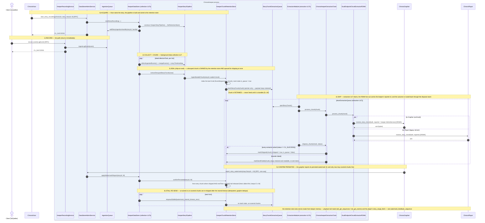

# ChronoKeeper — chunk durability lifecycle under the watermark protocol (sequence)

The `watermark-feedback` branch replaces ack-less chunk deletion with **durability-gated retention**. `KeeperTailStore` becomes `KeeperChunkRetentionStore`, which owns every sealed chunk. A chunk is **ship-on-seal** (its pointer enters the extraction queue the instant it seals) but is freed only once it is durable: `shipped ∧ chunk.endTime ≤ W ∧ tail-released` (invariant `E ≤ W`). Drain outcomes route back through the extraction module's **disposal seam** (`markShipped` / `markSendFailed`); the grapher's persisted watermark `W` arrives via `report_story_watermarks` → `confirmPersisted`; un-acked/un-covered chunks are re-shipped by the stall timer (`requeueStalled`). Fonts enlarged ~50%. See also [watermark_feedback_sequence](../Watermark/watermark_feedback_sequence.md).

