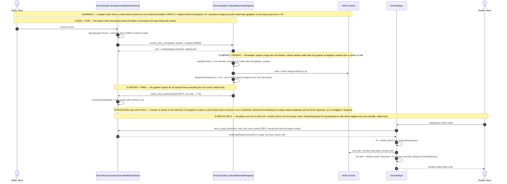

# Watermark feedback protocol — Keeper ↔ Grapher ↔ Player (sequence)

The cross-component view of the `watermark-feedback` branch. Chunk retention on the keeper is **durability-gated** by the grapher's persisted watermark `W`, upholding the invariant **`E ≤ W`** — a keeper never frees a chunk whose events are not confirmed durable in HDF5. The player then splits replay at **`B = min(hot_floor)`** across the story's keeper roster: everything below `B` is guaranteed archived, so the cold (archive) read stops at `B` and the hot side comes from the keepers on demand (`story_range_fetch`). Duplicates from re-sends/overlap are cleaned by read-side `EventSequence` dedup. Companion to `watermark_plan/watermark_protocol.md`. Fonts enlarged ~50%.

