## ChronoLog: A Distributed Shared Tiered Log Store with Time-based Data Ordering

## Authors

- **Anthony Kougkas**, Illinois Institute of Technology, Department of Computer Science, akougkas@iit.edu
- **Hariharan Devarajan**, Illinois Institute of Technology, Department of Computer Science, hdevarajan@hawk.iit.edu
- **Keith Bateman**, Illinois Institute of Technology, Department of Computer Science, kbateman@hawk.iit.edu
- **Jaime Cernuda**, Illinois Institute of Technology, Department of Computer Science, jcernudagarcia@hawk.iit.edu
- **Neeraj Rajesh**, Illinois Institute of Technology, Department of Computer Science, nrajesh@hawk.iit.edu
- **Xian-He Sun**, Illinois Institute of Technology, Department of Computer Science, sun@iit.edu

## Abstract

Modern applications produce and process massive amounts of activity (or log) data. Traditional storage systems were not designed with an append-only data model and a new storage abstraction aims to fill this gap: the distributed shared log store. However, existing solutions struggle to provide a scalable, parallel, and high-performance solution that can support a diverse set of conflicting log workload requirements. Finding the tail of a distributed log is a centralized point of contention. In this paper, we show how using physical time can help alleviate the need of centralized synchronization points. We present ChronoLog, a new, distributed, shared, and multi-tiered log store that can handle more than a million tail operations per second. Evaluation results show ChronoLog's potential, outperforming existing solution by an order of magnitude.

## Index Terms

distributed log, shared log, tiered storage

## I. INTRODUCTION

Today, data is being generated at a rate that even the largest computing systems cannot handle [[1]](#ref-1), [[2]](#ref-2). Further, significant developments in hardware innovation have lowered the monetary cost of data storage (less than $0.02 per GB), leading to a 'store everything' mindset [[3]](#ref-3). This data explosion stems from the proliferation of modern sensors, IoT devices, web activity, mobile and edge computing, telescopes, enterprise digitization, and others. In addition to the data production caused by human activity, computer systems are also producing data caused by systems synchronization, fault tolerance replication techniques, system utilization monitoring, service call stack, error debugging, and so much more [[4]](#ref-4), [[5]](#ref-5). Among all this data production, one common trend is the need to store activity data, also known as log data , which describes things that happen rather than things that are (i.e., maintain what happened and when). Several domains such as Internet companies and their web services, financial applications, scientific computing, and the Internet-of-Things (IoT) rely heavily on processing log data efficiently. This trend is further supported by modern nonmonolithic architectures such as microservices, containers, and task-based computing. Today, the activity data volume, velocity, and variety is staggering, reaching up to 7 TB/s [[6]](#ref-6), demanding a rethinking of the storage stack we have today.

Modern applications spanning from Edge to Cloud to High-Performance Computing (HPC), produce/process log data and create a plethora of workload characteristics that rely on a common storage model, the distributed shared log. Applications such as key-value stores and column databases [[7]](#ref-7), [[8]](#ref-8), message brokers [[9]](#ref-9), [[10]](#ref-10), metadata, coordination, and file system namespace services [[11]](#ref-11), [[12]](#ref-12), [[13]](#ref-13), [[14]](#ref-14) are sensitive to latency and require fast operations at the end of the log (i.e., appends and tail reads). Other applications, such as search query engines [[15]](#ref-15), [[16]](#ref-16), ML training pipelines [[17]](#ref-17), and graph exploration [[18]](#ref-18), [[19]](#ref-19) require high-throughput for processing historical data in the log (i.e., catch-up reads). Log durability is particularly important in transactions [[20]](#ref-20), [[21]](#ref-21) and to provide fault tolerance in databases (e.g., update and edit logging) [[22]](#ref-22), [[23]](#ref-23). Streaming apps [[24]](#ref-24), [[25]](#ref-25), [[26]](#ref-26), [[27]](#ref-27) and replication engines [[28]](#ref-28), [[29]](#ref-29), [[30]](#ref-30) stress out the importance of the log's write availability (i.e., high data ingestion rate). Time-series applications [[31]](#ref-31), [[32]](#ref-32) and indexing [[33]](#ref-33), [[34]](#ref-34) demand efficient range queries on logs, a requirement especially difficult to implement on top of an append-only data structure. Lastly, sensor data analysis [[35]](#ref-35), modern microservices [[36]](#ref-36), [[37]](#ref-37), and containerized workloads [[38]](#ref-38) require tunable parallelism semantics across logs (i.e., log seasonality). Many of these applications' log requirements are often conflicting with one another. Further, applications do not run in isolation but in integrated workflows, making it harder to satisfy these requirements under the same system.

To address the diverse requirements of applications, both industry and scientific communities have adopted several distributed shared log store designs, each motivated by their pre-dominant running workloads. Cloud-based distributed shared log projects include the Apache Kafka [[39]](#ref-39) and the Apache Bookkeeper [[40]](#ref-40). These log stores expose a typical log API including append and tail read to/from the end of the log and catch-up read from a given event. Also, they can scale well in production (e.g., Twitter's Bookkeeper case: 1.5 trillion records per day, record size from 100 bytes to hundreds of KBs, 5-10ms latency, 17.5 PBs per day, million logs on more than 1000 servers deployment). Advanced features include log replication, geo-distribution, consumer groups, and epochbased visibility of log updates. On the other hand, the HPC community has developed its own distributed shared log stores mostly due to different philosophies, target environment, and software stacks. These include Corfu [[41]](#ref-41) and its derivative implementations in the form of SLoG [[42]](#ref-42) and ZLog [[43]](#ref-43). These log stores lack advanced features since their main objective is high performance. Corfu can achieve 200K appends per second using only 50 SSD drives. SloG was shown to be able to scale to 100K cores peaking at 174 million appends per second. What is common across all those log stores is the difficulty of imposing total ordering. Some choose to address this by defining only a single leader at a time responsible for the tail of the log, effectively limiting the log parallelism. Others distribute entries everywhere in the cluster with the help of a centralized sequencer, which enforces the order, but limits the overall throughput of the log. Thus, a distributed shared log store that offers total ordering, high concurrency and parallelism, and capacity scaling is highly desirable.

The simplicity of the log abstraction, however useful it may seem, causes several problems when it gets distributed and shared. Designing a distributed shared log store is challenging for several reasons. First, ensuring data (e.g., record, entry, event) total ordering in a distributed shared log is very difficult and expensive, because assigning a log position (i.e., finding the tail of the log) creates a single point of contention. Cloudbased log stores address this by only offering ordering within a segment or partition and not throughout the entirety of the log. HPC-based log stores opt for a centralized sequencer that enforces the log order at the expense of serializing requests. Some log stores choose to provide client-side log ordering within given epochs (i.e., time windows) that can limit the value of the log semantics. Second, since a log is an appendonly structure, log stores need to be able to efficiently scale their available log capacity . Existing log stores address this by either imposing time- or space-based data retention policies (i.e., data are kept within a specified time window and any log entry older than the window is deleted or moved to a cold storage external solution) or by adding more servers (i.e., horizontal scaling). Third, a shared log has to efficiently support highly concurrent log operations by multiple clients. Existing log stores only offer a single-writer-multiple-readers (SWMR) data access model which is a result of the active partition or the centralized sequencer approach. This limits their operation concurrency , and therefore their performance potential. Fourth, I/O parallelism is crucial to the overall performance of a log store. Existing solutions rely on an application-centric degree of data parallelism (i.e., the caller is actually performing the I/O) which is a weaker parallel model as log data volume and velocity are expected to grow. Some log stores aim to alleviate this requirement by defining consumer groups (i.e., groups of multiple clients reading the same log), which creates an implicitly parallel I/O model. Lastly, partial data retrieval (i.e., log querying) is not supported by the existing solutions. Additional, often expensive, auxiliary indices are required to address data exploration. For instance, Bookkeeper relies on metadata look-ups whereas Corfu provides client side epochs (which limits the visibility of log entries across processes to the granularity of the epoch size). The ability to execute range reads on a log is highly desirable but quite challenging to efficiently support in log stores, which do not offer random access.

In this paper, we present the design and implementation of ChronoLog, a new distributed shared log store that uses physical time to provide total ordering on a log as well as auto-tiering across multiple storage tiers, such as storageclass memories (e.g., 3D XPoint) and new flash storage (e.g., NVMe SSDs), effectively scaling the log capacity infinitely. ChronoLog adopts a tunable parallel access model offering multiple-writers-multiple-readers (MWMR) semantics and highly concurrent I/O to/from the multi-tiered storage environment. ChronoLog also offers the ability to process the log with partial reads via range queries. ChronoLog is designed to offer high performance via I/O isolation (tail and historical operations are handled separately), elastic storage capabilities, and a novel 3D log distribution. ChronoLog and its design makes the following contributions:

1. Demonstrate how physical time can be used to order log data offering a scalable log distribution and the ability to support efficient range data retrieval.
2. Showcase how multi-tiered storage can be used to scale the capacity of a log and offer tunable data access parallelism.
3. Highlight how elastic storage semantics can match I/O production and consumption rates supporting conflicting workloads under a single system.

## II. BACKGROUND AND MOTIVATION

## A. Log-centric Computing

### 1. The rise of activity (log) data

New challenges for data systems are created by recent trends in modern applications that utilize log data within integrated production workflows. For instance, the business model of many, if not all, Internet companies and hyperscalers relies on their ability to track user activity (e.g., logins, clicks, comments, search queries, etc.,) and analyze it to produce recommendations, targeted advertisement, spam and security protection, and content relevance [[39]](#ref-39). Similarly, financial applications (e.g., banking, high-frequency trading, etc.,) support the economy by accurately and promptly monitoring financial activity (e.g., transactions, trades, etc.,) and perform time-series analysis to provide real-time fraud protection [[44]](#ref-44). Another trend is the explosion of the Internet-of-Things (IoT) [[45]](#ref-45) and Edge computing [[46]](#ref-46). Smart City initiative Array of Things [[47]](#ref-47) has deployed citywide sensors measuring several environmental factors that will help solve a range of urban challenges [[48]](#ref-48), [[49]](#ref-49). Lastly, several scientific domains rely heavily on collected log data (i.e., observed data) to drive discovery. Scientific instrument sensors are used in many domains and knowledge extraction is dependent on the ability to quickly ingest the high rate of incoming data (e.g., SKA telescopes produce several TB/s) [[50]](#ref-50), [[51]](#ref-51). Connecting two or more stages of a data processing pipeline without explicit control of the data flow while maintaining the data durability is a common theme.
### 2. Logs as a storage abstraction

A log is perhaps the simplest possible storage abstraction. It is an append-only, totally-ordered sequence of immutable data entries. Often, the contents and format of the entries are not important. Data are appended to the end of the log, and reads proceed left-to-right in a linear scan fashion. However, a log does not support inplace updates. The ordering of a log's data elements defines a notion of 'time' since entries at the beginning (leftmost positions) are guaranteed to be older then entries at the end of the log (rightmost positions). Each entry is assigned a unique log sequence number. Data is written into the log in indivisible entries, rather than individual bytes. More importantly, a log entry is the smallest unit of addressing: a reader always starts reading from a particular entry (or from the next entry to be appended to the log) and receives data one or more entries at a time. In a sense, a log is not very different from a typical file or table. A file is an array of bytes, a table is an array of records, and a log is an immutable sequence of ordered data entries. It does however relax the data model semantics to better balance the trade-off between availability, durability, and performance than a strictly POSIX-compliant distributed storage system.

### 3. Logs as a building block

Logs, sometimes called write-ahead logs or commit logs or transaction logs, have been around almost as long as computers and are at the heart of many distributed data systems and real-time application architectures. A core design challenge for distributed data systems is the ability to agree upon an order of concurrent changes in a state (i.e., making distributed processing deterministic). A distributed shared log can model the problem of reaching consensus since it represents a highly available and durable source of repeatable totally ordered events. Shared logs are a strong and versatile primitive that can provide strong consistency, durability, failure atomicity, transactional isolation, and asynchronicity [[11]](#ref-11). In other words, a log can act as an authoritative source for the state of multiple machines (i.e., logical 'clock'). This simple observation places logs in the center of distributed systems where a log can be a commoditized building block for several scalable distributed applications such as [[9]](#ref-9), [[21]](#ref-21), [[30]](#ref-30), [[52]](#ref-52), [[53]](#ref-53), [[54]](#ref-54), [[55]](#ref-55), [[56]](#ref-56), [[57]](#ref-57), [[58]](#ref-58): a) a consensus engine for consistent replication and indexing services, b) a transaction arbitrator for isolation, atomicity, and durability, c) an execution history for replica creation and synchronization, d) a geo-distribution engine, e) a primary log-structured data store with 'commit' semantics to the writer for snapshots and checkpointing, f) a data integration and warehousing endpoint connecting two stages of a data processing pipeline, g) a backend for real time streaming processing with external data subscription feed, NoSQL/Key-Value stores and file systems, messaging, queuing, and other shared data structures, and h) a platform for decoupled and event-driven systems as well as debugging, auditing, and version control mechanisms.

## B. Existing Distributed Shared Log Stores

Scaling the capacity of a shared log requires distributing its entries across many machines while maintaining the order of the log. There are two classes of log stores that achieve this.

### 1. Cloud-based Log Stores

In the Cloud computing space, the Apache Foundation has fostered several distributed shared log projects such as Kafka [[39]](#ref-39), Bookkeeper [[40]](#ref-40), and DistributedLog [[59]](#ref-59). Further, Apache Pulsar [[60]](#ref-60) and EMC's Pravega use Bookkeeper as the back-end log store, establishing it as the dominant solution in this space. The main idea behind these log stores' data distribution is the organization of a log (a.k.a. topic or ledger) into smaller pieces (a.k.a. partitions, segments, active ledgers) which are mapped to a single server. Hence, data are distributed not with a log-entry but with a log-partition granularity. Each server is responsible for several partitions across different logs but only one partition is active per log at a given time. Clients have to ping the metadata manager to get the server ID that currently holds the active partition and then push their data to the log. Once the active partition is full, it closes and operations are redirected to a new active partition. Since only one partition can be active and only one server is responsible to hold it, the order within the partition is enforced by server arrival time. Thus, Bookkeeper provides only partial ordering in a log (i.e., only partition ordering is guaranteed). All tail operations are executed by only the single server that holds the active partition. Only historical reads will be implicitly parallel since they might read data from several replicated partitions, and, thus, multiple servers. Scaling the log store is achieved by adding more servers which will accept future partitions. Some log stores perform log partition migrations upon adding more servers for load balancing. Partitions are also replicated to increase read availability and log durability.
### 2. HPC-based Log Stores

Log stores are not very common in HPC and are difficult to implement on top of the storage stack. A popular log store solution, that also gave birth to many others, is Corfu [[41]](#ref-41), [[61]](#ref-61), [[62]](#ref-62). The Corfu protocol organizes a collection of flash devices (i.e., SSD drives) into a single shared log that can be concurrently accessed by many clients over a network. A different implementation of the Corfu protocols called SloG [[42]](#ref-42) maps events to a collection of Lustre OSTs instead of SSD pages. Similarly, ZLog [[43]](#ref-43) implements Corfu protocols by mapping events to a collection of RADOS objects in Ceph. Additionally, several high-level abstractions on top of Corfu have been presented in the literature. Tango [[11]](#ref-11) offers several distributed data structures over the shared log abstraction. vCorfu [[63]](#ref-63) provides a strongly consistent object store on top of a shared log targeting extreme scales. The main idea behind these log stores is the explicit parallelism of the log access. In this class of log stores, the granularity of data distribution is not a log partition but an SSD page or an object. A centralized sequencer is employed to provide order by handling the tail of the log. Clients access the log after they call the sequencer to identify which SSD page to write. This increases the log parallelism since different log entries are spread to the entire cluster, but is limited by the performance of the sequencer [[7]](#ref-7). Since these designs focus on performance, these log stores lack advanced features such as geo-distribution. Additionally, features such as durability and high-availability depend on the support of the underlying storage subsystem (i.e., Ceph, Lustre). Lastly, they do not support elasticity (i.e., adding more servers on demand), limiting the scalability of the log capacity.
### 3. Limitations and Challenges of Existing Solutions

What the above log stores, both Cloud- and HPC-based, have in common is the logical abstraction of a shared log and its API. However, there are several differences and limitations stemming from the design of each log store. More specifically, Bookkeeper's limitations include: a) all tail operations are serviced by a single server, b) additional storage footprint caused by writing data in both a journal and in an entry log, c) increased metadata lookup costs (i.e., it relies heavily on Zookeeper for all metadata info).

**Table I: Distributed Shared Log Stores Feature Matrix**

| Features                              | Bookkeeper Kafka / DLog        | Corfu SloG / ZLog         | ChronoLog               |
|---------------------------------------|--------------------------------|---------------------------|-------------------------|
| Locating the log-tail                 | MDM lookup (locking)           | Sequencer (locking)       | MDM lookup (lock-free)  |
| I/O isolation                         | Yes                            | No                        | Yes                     |
| I/O parallelism (readers-to-servers)  | 1-to-1                         | 1-to-N                    | M-to-N (always)         |
| Storage elasticity (scaling capacity) | Only horizontal                | No                        | Vertical and horizontal |
| Log hot zones                         | Yes (active ledger)            | No                        | No                      |
| Log capacity                          | Data retention                 | Limited by # of SSDs      | Infinite (auto-tiering) |
| Operation Parallelism                 | Only Read (Implicit)           | Write/Read                | Write/Read              |
| Granularity of data distribution      | Closed Ledgers (log-partition) | SSD page (set of entries) | Event (per entry)       |
| Log total ordering                    | No (only on partitions)        | Yes (eventually)          | Yes                     |
| Log entry visibility                  | Immediate                      | End of epoch              | Immediate               |
| Storage overhead per entry            | Yes (2x)                       | No                        | No                      |
| Tiered storage                        | No                             | No                        | Yes                     |

 On the other hand, Corfu's limitations include: a) all operations are tokenized via the sequencer, b) fragmentation of logs requiring trim and fill API calls to reclaim space, c) client-side synchronization via epochs making entries visible only after the epoch projection commits all appends, and d) ordering entries within segments requires a seal operation which means log ordering is achieved only eventually. All of the existing log stores are challenged from balancing log ordering, write-availability, log capacity scaling, parallelism, log entry discoverability, and performance. These requirements are often conflicting. For instance, durability and fault tolerance causes increased write latency, log range queries require additional expensive indexing, and efficient catch-up reads demand log ordering. Each design makes some choices as to what to optimize. There is no 'one-size-fits-all' between the existing log stores. Table I shows the feature set of each class of log stores. New distributed shared log store designs are required to address the growing demand for a solution that offers total ordering, high concurrency and parallelism with log-entry granularity, and the ability to scale its capacity infinitely.

## C. Motivation

Two key observations motivate us to design a new distributed shared log store. First, as stated earlier, the log abstraction encapsulates the idea of a logical 'clock' since the ordering of entries in a log defines a notion of time. However, as shown in Section II-B, this ordering is hard to achieve in a distributed and shared environment due to the synchronization costs incurred by agreeing upon which request gets the next log sequence number. In this work, we argue how using physical time as a globally meaningful number, representing the log entry position (i.e., log sequence number or log offset) in a log, can resolve several of the issues that distributed shared log stores face. The physical timestamps naturally reflect a serialization order satisfying the linearizability property [[64]](#ref-64) of a log store. Traditionally, storage solutions avoid using physical time as a data identifier and prefer instead a unique

ID. A timestamp has been typically used as an additional attribute to a data entry. In this paper, we show how data consistency can be built around a system that uses physical time as a data identifier and handles the clock uncertainty and drift rate. A similar approach has been used by Spanner [[65]](#ref-65), Google's globally-distributed database. Spanner uses physical time to globally distribute replicas of a database by modelling the clock uncertainty. A key insight is that a combination of the append-only nature of a log abstraction and the natural strict order of a global truth, such as physical time, can be combined to build a distributed shared log store that avoids the need for expensive synchronizations.

Second key observation we make in this study is the rising trend of the existence of multiple tiers of storage organized in a hierarchy [[66]](#ref-66). Innovations in hardware technologies such as persistent memory [[67]](#ref-67) (i.e., storage-class memory [[68]](#ref-68)) and new flash storage devices [[69]](#ref-69) (e.g., NVMe SSD) aim to bridge the gap between DRAM and HDD performance. Many system designs incorporate such technologies in various forms and shapes. Compute nodes are now equipped with node-local fast storage [[70]](#ref-70), burst buffers [[71]](#ref-71), [[72]](#ref-72) are placed in between compute and storage nodes, and data staging resources [[73]](#ref-73) are placed side-by-side with compute nodes. Hierarchical storage designs are expected to be the norm in many modern computing environments. A key insight is that a multi-tiered storage environment creates a spectrum of performance and capacity per tier. Higher levels of the hierarchy (e.g., DRAM, Intel Optane PM) are faster but smaller in capacity than lower levels (e.g., NVMe, SSD). In this paper, we argue that the log abstraction provides a simple yet powerful property: entries at the end of the log are guaranteed to be newer than entries at the beginning. We show that an efficient mapping of the log entries to the tiers of the hierarchy (i.e., auto-tiering a log) can help scale the capacity of the log and offers two important I/O characteristics: tunable access parallelism and I/O isolation between tail and historical log operations.

## III. CHRONOLOG

ChronoLog is a new class of a distributed shared log store that leverages physical time for achieving total ordering of log entries and utilizes multiple storage tiers to distribute a log both horizontally but vertically (a distribution we call 3D data distribution). ChronoLog takes advantage of the strictly linear global order that physical time imposes to achieve synchronization-free log ordering, a highly concurrent log access model (MWMR), and the ability to process a log partially via data range retrieval mechanisms. The log auto-tiering capability of ChronoLog allows the system to effectively scale the log capacity infinitely and offer a more parallel and elastic I/O model. The set of features that ChronoLog embodies, as well as its adaptive nature, make the system ideal for a diverse collection of applications from scientific to Web and IoT. ChronoLog is particularly well suited for time series analysis applications due to its properties of time-based data ordering and support for log range retrieval.

## A. Design and Architecture

### 1. Design Requirements

As any distributed shared log store, ChronoLog is responsible for the organization, storage, and retrieval of activity data. ChronoLog's main objective is to support a wide variety of applications with conflicting log requirements under a single platform . ChronoLog's objectives are set by the design innovations in the following areas:
- a) Log distribution : Log data should be distributed by a logentry (rather than log-partition) granularity, resulting in a highly parallel distribution model. Further, log data should be distributed both horizontally (i.e., multiple nodes) but also vertically (i.e., multiple tiers of storage). Hence, the system follows a 3D distribution model defined by a 3tuple of ( logs, nodes, tiers ) forming a square pyramidal frustum [[74]](#ref-74) (i.e., top truncated pyramid).
- b) Log ordering : Finding the tail of the log should be free of expensive synchronizations such as metadata locking or a centralized sequencer that enforces the order. Additionally, the system should guarantee ordering of entries on the entirety of a log and not only on a log-partition granularity.
- c) Log access : Interacting with the log should follow a highly concurrent access model effectively providing multiplewriter-multiple-reader (MWMR) semantics. Further, tail and historical log operations should be handled separately via I/O isolation. The log should not favor one type of operation over the other offering high performance for both. Lastly, the log must be able to be partially processed via range retrieval moving away from a limiting sequential access model imposed by mechanisms such as log iterators.
- d) Log scaling The log should be able to scale its capacity and automatically expand its footprint to multiple storage tiers via auto-tiering. No explicit user intervention should be required. The system should map the natural ordering of a log to the spectrum of performance characteristics of each storage tier (e.g., recent entries in upper tiers, older entries in lower), potentially scaling the log capacity infinitely.
- e) Log storage Persisting log data should be executed by a tunable parallel I/O model to match the rate of log data production. In other words, the storage infrastructure must be elastic and adaptive via storage auto-scaling leading to better performance and resource utilization. Additionally, a tiered log store should leverage the type of the target storage device (e.g., NVMe SSDs are less sensitive to random access than HDD that prefer sequential access).
### 2. Abstractions and Operations

ChronoLog's data model revolves around the chronicle abstraction. A chronicle, which represents a typical log created by the user, is a named data structure that consists of a series of data elements ordered by physical time. Each data element, called an event , is a simple key-value pair. The key is a ChronoTick (i.e., time tick or slot) and the value is an uninterpreted byte array. A ChronoTick is a monotonically increasing positive integer ( uint32\_t ) representing the time distance from a base value of a chronicle (i.e., offset from beginning of time). A chronicle's base value is the creation timestamp, set by a global clock. A chronicle is indexed by a configurable granularity expressed in time units such as nanoseconds (default in ChronoLog). By adjusting the indexing granularity, a chronicle can group multiple events while maintaining its order. A tags structure stores a list of chronicle properties and other metadata such as the total size in bytes, ownership details, permission flags, and access mode (e.g., read/write). The property list includes the chronicle type (e.g., prioritized), the indexing granularity (e.g., ns, ms, seconds, etc.,), the auto-tiering policy for the hierarchical storage, and the data coherency semantic.

Since ChronoLog is a multi-tiered distributed log store, the storage representation of a chronicle highly depends on its tiered distribution. Leveraging the latest trends in hardware innovation, the machine model ChronoLog aims to support is as follows: compute nodes equipped with a large amount of RAM and local NVMe devices, a shared burst buffer installation based on SSD equipped nodes, and a remote PFS installation based on HDDs (motivated by the recent machines Summit in ORNL or Cori in LBNL). The events of a chronicle travel through the tiers of storage. In higher tiers (i.e., NVMe and SSD) the events are stored in the form of key-value pairs in a distributed persistent journal. For the HDD tier, events are first sorted and then written sequentially in a file, called a story . Hence, a chronicle is a collection of stories, which in turn are collections of ordered events. The story abstraction allows ChronoLog to leverage the type of storage device. In other words, parallel file systems deployed on top of HDDs are expected to perform well when the access is sequential.

The operations a chronicle supports resemble the typical log operations: record an event (append), playback a chronicle (tail-read), and replay a chronicle from a given event (catch-up read). ChronoLog also allows replay operations to accept a vector of ranges (i.e., a start and end event), enabling partial access to a chronicle. Clients need to first acquire a named chronicle before they record any events to it. ChronoLog maintains an acquisition counter that is used to guide data movements through the tiers. For instance, a chronicle that is acquired by many clients is expected to have a higher probability to be accessed, and, therefore, should be kept in higher tiers of the storage hierarchy. A chronicle can be deleted from a ChronoLog cluster or migrate from one cluster to another. Lastly, a chronicle cannot be mutated as it is an append only structure. However, the chronicle abstraction could allow for partial range deletions but only in the beginning or the end of it.

### 3. System Overview

ChronoLog is a distributed shared log store that can be deployed on a cluster with multiple tiers of storage. Figure 1 demonstrates the architecture of a ChronoLog cluster which consists of the following three main components: a ChronoVisor, a ChronoKeeper, and a tiered ChronoStore. The ChronoVisor handles client connections and chronicle metadata information. It also acts as the global clock enforcing time synchronization between all server nodes participating in a ChronoLog cluster. The ChronoVisor is deployed on its own server node (usually a head node). The ChronoKeeper serves all tail operations such as record() and playback(). It stores incoming events in a distributed journal.

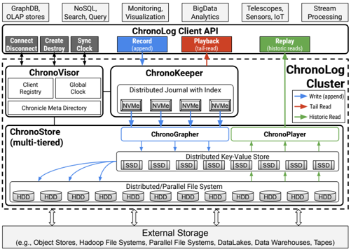

*Fig. 1. ChronoLog design overview*

 Event distribution is achieved by the eventID (i.e., the ChronoTick). The ChronoKeeper is deployed on all or a subset of compute nodes that are equipped with a fast flash storage device (e.g., NVMe). The ChronoStore manages both intermediate storage resources (e.g., burst buffers or data staging resources) and the storage servers. It is organized into two subcomponents, the ChronoGrapher and ChronoPlayer, which are responsible for writes and reads, respectively. The ChronoGrapher is using a real-time data streaming approach to continuously ingest events from the ChronoKeeper and persist them to lower tiers of the hierarchy. The ChronoPlayer serves historical reads in the form of replay() calls. Both ChronoStore subcomponents have the ability to grow or shrink their resources (e.g., writer or reader processes) offering an elastic solution that can match the I/O demand. A ChronoLog cluster can scale both horizontally, by adding more servers in any of its components, and vertically, by adding more tiers to its participating nodes. Lastly, ChronoLog has several connectors to external storage resources that can be used to either pull data in or push data out; thus it can act as a data warehouse solution.

To take full advantage of and interact with ChronoLog, applications use a client library that defines a native ChronoLog API (detailed in subsection III-A4). Clients have to first connect to a ChronoLog cluster by registering to the ChronoVisor. During connection, clients receive the ChronoVisor's base clock value and its clock drift rate that are used to calculate the client's time distance from the cluster. No client time synchronization is required (i.e., no need to change the client's machine clock) since ChronoLog handles time relative to a global time reference, that of the ChronoVisor in a cluster. Upon successful connection, a client can create a new (or acquire an existing) chronicle before any data operation takes place. Once the chronicle is created, a client can start recording (or replaying) events. ChronoLog implements a novel decoupled server-pull architecture that splits the process of event ingestion from event persistence. All incoming events are first received by the ChronoKeeper which indexes and writes them to its distributed journal.

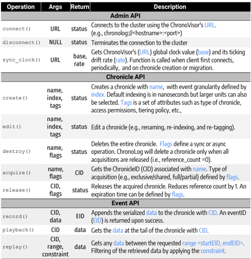

*Fig. 2. ChronoLog API*

| Operation     | Args                   | Return        | Description                                                                                                                                                                                                                                        |
|---------------|------------------------|---------------|----------------------------------------------------------------------------------------------------------------------------------------------------------------------------------------------------------------------------------------------------|
| Admin API     | Admin API              | Admin API     | Admin API                                                                                                                                                                                                                                          |
| connect()     | URL                    | status        | Connects to the cluster using the ChronoVisor's URL. (e.g., chronolog://<hostname>:<port>)                                                                                                                                                         |
| disconnect()  | NULL                   | status        | Terminates the connection to the cluster                                                                                                                                                                                                           |
| sync_clock()  | URL                    | base, rate    | Gets ChronoVisor's (URL) global clock value (base) and its ticking drift rate (rate). Function is called when client first connects, periodically, and on chronicle creation or migration.                                                         |
| Chronicle API | Chronicle API          | Chronicle API | Chronicle API                                                                                                                                                                                                                                      |
| create()      | name, index, tags      | status        | Creates a chronicle with name, with event granularity defined by index. Default indexing is in nanoseconds but larger units can also be selected. Tags is a set of attributes such as type of chronicle, access permissions, tiering policy, etc., |
| edit()        | name, index, tags      | status        | Edit a chronicle (e.g., renaming, re-indexing, and re-tagging).                                                                                                                                                                                    |
| destroy()     | name, flags            | status        | Deletes the entire chronicle. Flags define a sync or async operation. ChronoLog will delete a chronicle only when all acquisitions are released (i.e., reference_count =0).                                                                        |
| acquire()     | name, flags            | CID           | Gets the ChronicleID (CID) associated with name. Type of acquisition (e.g., exclusive/shared, full/partial) defined by flags.                                                                                                                      |
| release()     | CID, flags             | status        | Releases the acquired chronicle. Reduces reference count by 1. An expiration time can be defined by flags.                                                                                                                                         |
| Event API     | Event API              | Event API     | Event API                                                                                                                                                                                                                                          |
| record()      | CID, data              | EID           | Appends the serialized data to the chronicle with CID. An eventID (EID) is returned upon success.                                                                                                                                                  |
| playback()    | CID                    | data          | Gets the data at the tail of the chronicle with CID.                                                                                                                                                                                               |
| replay()      | CID, range, constraint | data          | Gets any data between the requested range <startEID, endEID>. Filtering of the retrieved data by applying the constraint.                                                                                                                          |

Note that the distributed journal's capacity is finite and limited. Hence, the ChronoGrapher runs a data streaming job which continuously collects events from the distributed journal, in real time, and writes them to a distributed key-value store (KVS) running on top of SSDs. Each KVS server is responsible for a range of eventIDs. Once enough events are collected or sufficient time has passed, the ChronoGrapher builds a story by sorting the events. Stories are then written out, using parallel I/O (e.g., MPI-IO), to a file in the HDD-based PFS. ChronoLog handles tail and historical operations separately by different components (and tiers), offering an I/O isolation property to its data model.

### 4. ChronoLog API

The ChronoLog API, provided by a client library, consists of an Admin, a Chronicle, and an Event API listed and described in Figure 2. The Admin API exposes management operations including client handling via a registry and cluster time management by running the global clock. The Chronicle API exposes the metadata operations that include managing the chronicle namespace, access properties, and the manipulation of chronicle tags. The Event API mostly exposes the interface for data interactions including write and read.

The power of the ChronoLog API stems from the chronicle abstraction. For example, the indexing granularity defined at the creation can be edited to a larger one (e.g., from nanoseconds to seconds) which leads to a grouping of events around the new granularity. The API also enables the ability to partially acquire a chronicle in three modes: a) from the beginning until a given eventID, b) from a given eventID until the end, or c) between two eventIDs. This creates a chronicle projection which helps ChronoLog achieve better resource utilization. Furthermore, a hinting mechanism using a set of tags and/or flags is exposed to enable additional functionality. For instance, a client can request a chronicle acquisition for a given time period.

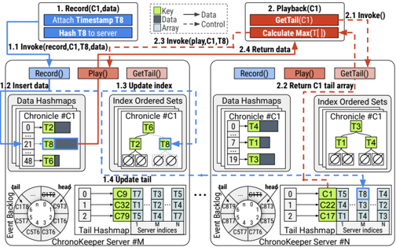

*Fig. 3. ChronoKeeper design and architecture.*

 Once the timer expires, the acquisition will automatically be released and the user will lose access. This can help eliminate orphaned handles of acquired chronicles. Another flag, for example, allows a user to instruct the system to delay the ChronoGrapher evictions keeping the events of an important chronicle (e.g., user metadata) in the ChronoKeeper for a longer period of time (i.e., faster access). Finally, ChronoLog can perform range retrievals on the eventIDs without the need of an auxiliary index. This capability is inherited from ChronoLog's use of physical time to order data (i.e., primary index). We argue that this functionality is especially useful to time series applications. Example queries could be ' bring me all events from chronicle stock\_values for all Mondays of 2012 ', or ' get me all events from chronicle bank\_transactions between January and March of all even years since 2000 '.

## B. Tail Operations via ChronoKeeper

The ChronoKeeper is responsible for all chronicle tail operations, and, thus, is the gateway to the ChronoLog cluster. It manages the highest available storage tier (e.g., NVRAM, NVMe) on a ChronoLog cluster. It is a distributed component that can either be deployed within each compute node, colocated with the client, or on a dedicated subset of compute nodes by a configurable ratio between client and ChronoKeeper servers (e.g., 1-to-64 server-to-client processes). If an I/O forwarding layer exists, the ChronoKeeper can be deployed on those nodes. Its main goal is to offer a highly available and durable space for incoming events acting as a 'cache', on top of the ChronoStore, that holds the latest events. Figure 3 shows the design and data structures of the ChronoKeeper.

### 1. ChronoKeeper data structures

The ChronoKeeper uses several distributed data structures implemented by the HCL library [[75]](#ref-75), a high performance RPC protocol over RDMA/RoCE with the ability to invoke callbacks on the server. HCL was chosen because it automatically distributes several C++ STL-like data structures while having the ability to also persist them on NVMe or SSD drives. Upon system initialization, the ChronoKeeper servers expose a shared memory window for deploying the following data structures:

- a) Distributed journal: holds the data of incoming events. It consists of a collection of data hashmaps distributed on all ChronoKeeper servers. Event insertion time complexity is O (1) since keys are not sorted. All operations are lock-free making the journal highly concurrent.
- b) Chronicle index: provides indexing over the journal with one ordered set of eventIDs per data hashmap. The purpose of the chronicle index is not to locate individual events but to maintain their order. It is only used by the ChronoPlayer during replay operations (more in subsection III-D). It provides O ( logn ) for both lookups and insertion operations.
- c) Tail hashmap: provides a lock-free method to update chronicle tails. It is a distributed hashmap with chronicleID as the key and an array, with size equal to the number of ChronoKeeper servers, of the latest eventIDs per chronicle as its value. It is used by the clients to efficiently locate the tail without any synchronizations or locking.
- d) Event backlog: maintains a list of events that have already been copied from the ChronoKeeper to the ChronoStore. It is implemented by a circular queue of tuples ( chronicleID, eventID ) with O (1) complexity for pop/push operations. It is used by the ChronoKeeper to target events that can be safely removed from the journal.

The tail hashmap and the event backlog are initialized upon system init() , whereas the data hashmaps and chronicle index are initialized when a chronicle is created or acquired. All of the above structures are initialized by the ChronoVisor.

### 2. Record

Let us follow a record() call and its journey through the ChronoKeeper (blue arrows in the figure). The client calls record() on a chronicle and passes the data. ChronoLog's client library will first calculate the ChronoTick and then hash it to get a serverID. By default, ChronoLog uses a uniform hashing to achieve an embarrassingly parallel event distribution and load balance among ChronoKeeper servers. The high availability and durability requirements are, thus, satisfied by this event distribution. When in co-located mode, a locality-aware hashing algorithm [[76]](#ref-76), [[77]](#ref-77) may be used to direct local traffic to the local drive, but at the risk of creating hot zones. In contrast to existing solutions based on the Corfu protocol, the ChronoKeeper does not need a sequencer to manage the tail of a chronicle. This is automatically handled by the ChronoTick abstraction that encapsulates the natural property of physical time: a strictly and monotonically increasing order. Once the serverID is determined, the client will invoke a record() callback on the target server passing the chronicle name, the ChronoTick, and the data. Once the server receives the call, it will insert the data in its local data-hashmap, while at the same time update the chronicle index and tailhashmap. Note that the tail-hashmap update is atomic and does not require locking. The cost of the two update operations is hidden behind the data operation, which is expected to last longer. Also note that the client bundles all the three operations into one RPC call instead of making multiple client-to-server roundtrips. Once all three operations complete, the client can exit. A record() call can fail when: a) the chronicle has not been created or acquired, b) the ChronoKeeper's capacity bounds have been reached, or c) the incoming event is backdated, violating the chronicle's immutability.

### 3. Playback

The performance of a tail-read in any distributed log store is determined by the ability to quickly locate the tail of a distributed log. In ChronoLog getting the tail is achieved by a playback() call to the ChronoKeeper. Let us follow the red arrows in Figure 3 that show how getting the tail of a chronicle works. The client calls playback() with a chronicle name. The client library will first invoke the get tail() function on the ChronoKeeper server responsible to hold the tail-hashmap for that particular chronicle (i.e., the chronicle name gets hashed to a specific server). The server will return an array of eventIDs, indexed by serverIDs, that represent the latest events each ChronoKeeper server has at the time of the call. The client will then locate the max ChronoTick in the array and use its index to invoke a play() on that server. Upon receiving the call, the ChronoKeeper server will get the data from its data hashmap and return them to the client. Getting the event out of the data hashmap incurs a random read which can be slow on a spinning hard drive. However, ChronoKeeper servers utilize newer flash storage devices (e.g., NVMe) which are expected to perform well under such access patterns. Additionally, a byte-addressable storageclass memory will further boost this operation. Due to network latency between the playback and any other outstanding record operation, ChronoLog guarantees that the clients will not get an event newer than the time of playback call plus the network latency L , which, as stated earlier, is measured during client connection or chronicle acquisition. The ChronoKeeper offers a lock- and synchronization-free solution to finding the tail of a chronicle without the need of a centralized sequencer.

## C. Recording Data via ChronoGrapher

The ChronoGrapher is responsible for continuously persisting data from the ChronoKeeper journal to the ChronoStore. It is a distributed component that is deployed on the available resources in the data path from compute to the remote PFS (e.g., burst buffer or data staging nodes). To provide chronicle capacity scaling and since the ChronoKeeper's storage capacity is expected to be limited, ChronoLog needs to efficiently and automatically move data down to the next larger but slower tiers. To achieve this, the ChronoGrapher offers a very fast distributed data flushing solution that can match the event production rate (stemming from the ChronoKeeper), while imposing some order to the randomness of the journal in the top tier. The ChronoGrapher's objectives include:

- a) Real-time continuous data flushing: as soon as an event is written in the ChronoKeeper's journal, instead of batch flushing, free up space by immediately copying it down.
- b) Tunable parallelism (resource elasticity): match the incoming event production rate from the ChronoKeeper by resizing the resources accordingly (e.g., grow or shrink).
- c) Leverage the type of storage device: use the SSD's capabilities for random access but avoid such access on spinning drives at any cost. Create sequential access for HDDs.
- d) Decoupled from ChronoKeeper and clients: implement a server-pull instead of a client-push eviction model to amortize the operational cost; always execute in the background.

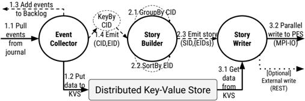

*Fig. 4. ChronoGrapher design and architecture.*

To achieve the above requirements, we implemented ChronoGrapher as a data streaming job executing three major steps in a DAG: event collection, story building, and story writing. Each node in the DAG is dynamic and can grow or shrink based on the traffic (i.e., number of events and size of data). To maximize performance by minimizing data movements between processing elements, ChronoGrapher splits the data from the control flow. In our prototype, we used Apache Flink to implement the DAG since it offers: ease of deployment, only-once delivery guarantees, elasticity capabilities, and fault tolerance semantics. We utilized Java's Native Interface (JNI) to interface the Java-based Flink framework to the rest of the C++ ChronoLog code. Let us follow Figure 4 that shows the design of ChronoGrapher and the three DAG nodes.

### 1. Event Collector

During system initialization or chronicle acquisitions, the ChronoVisor spawns the ChronoGrapher that connects the event collector processes to the specified sources (e.g., ChronoKeeper's journal). The number of event collector processes is dynamic. To match the available bandwidth of the more capable hardware on the upper tier, the number of event collector processes should be larger than (or worse case equal to) the number of NVMe drives the journal is deployed on. The event collector then starts pulling events from the journal (not removing them), and immediately writes them to the distributed key-value store (KVS). The ChronoGrapher's KVS follows a tablet-based distribution mechanism, inspired by Google's BigTable [[78]](#ref-78), where each server is responsible for a certain key range. This range is configurable during bootstrap by the ChronoVisor. The main reason we chose this approach is to preserve the temporal locality of events. To avoid hot zones (which would overwhelm an SSD server), the key range per server (i.e., time span in our context) is kept way smaller than the number of available SSD servers. Note that, at this point, events from the journal are mixed across different chronicles. Next, once the event data are written to the SSDs, the event collector will add the eventIDs to the ChronoKeeper's event backlog marking them as 'safe' to be removed. The backlog contribution is two-fold: ensuring durability and acting as a cache on top of the ChronoStore (i.e., events can stay longer in the ChronoKeeper as long as there is space). Lastly, the event collector will emit tuples of (chronicleID, eventID) to the next node of the DAG.

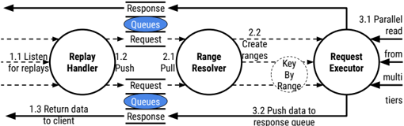

*Fig. 5. ChronoPlayer design and architecture.*

### 2. Story Builder

The story builder processes will first group the eventIDs by chronicleIDs. The KeyBy operator will dynamically create one node in the DAG per chronicleID. A story creation epoch is defined to avoid this process running forever. The length of the epoch is determined by either a given number of events has been reached, or the total size of the collected events is larger than a given threshold, or lastly if a configurable timer has expired. The intuition behind the story creation epoch is based on known good I/O practices (e.g., larger sequential I/O rather than small random). Once the epoch closes, a parallel running sort is used to sort the eventIDs and create the chronicle story. Note that only the eventIDs are necessary and no data movement happens during this phase. Lastly, the story builder emits a tuple of { storyID, set &lt; eventIDs &gt; } to the next node of the DAG.
### 3. Story Writer

The story writer processes will first determine which KVS servers hold the event data pertaining to the story and then execute a range-get from the KVS, which leverages the KVS key range distribution (i.e,. neighboring events are likely to be on the same SSD, increasing data locality). The event data are placed in a buffer and then the entire story is written to the HDDs using an MPI collective I/O call with multiple threads. The story is effectively a ChronoLog-specific file in the PFS. Note that, external storage can also be used.

## D. Replaying Data via ChronoPlayer

The ChronoPlayer is responsible for executing historical read operations. It is a distributed component that is deployed on all storage nodes throughout a ChronoLog cluster. It is initialized by the ChronoVisor upon system initialization. Since ChronoLog is a multi-tiered log store, at any given point a chronicle might be spread across several locations: only in the HDDs (in the form of one or more stories), in both the SSDs and HDDs (in the form of unsorted events and sorted stories), or even everywhere (with the latest recorded events residing in the ChronoKeeper). Hence, the ChronoPlayer needs to be able to access all tiers and read data efficiently. Similarly to the ChronoGrapher, it is implemented by a data streaming approach with a real-time, decoupled, and elastic architecture. Figure 5 shows its design and its three main DAG nodes: replay handlers, range resolvers, and request executors.

### 1. Replay Handler

Each replay handler process, running in each storage server (both SSD and HDD), hosts a request and a response queue. A client randomly selects a server from the group and sends its replay request. The only job of the replay handler is to push the incoming requests to the queue. Upon completion of the replay operation, the replay handler pushes the fetched data from the response queue to the client.

### 2. Range Resolver

The range resolvers pull one or more requests from the request queues. In case of increased replay demand, two or more resolvers can serve the same queue. At minimum, each queue has a resolver. Since a chronicle is spread across multiple storage tiers, each replay request might reflect multiple ranges across tiers. The resolver will create a vector of ranges for each replay request. Further, since we want to apply well-known I/O practices, a replay call may request a lot of data, and, hence, the resolvers will split it in several subrequests to better suit the read granularity (e.g., every 4MB). Lastly, as shown in subsection III-A4, the replay call can also pass a constraint on the range that may filter the fetched data. The resolvers will consider this constraint to further refine the ranges. Lastly, one possible optimization resolvers can do is to check the response queues before finalizing the ranges. If relevant data are found there, additional reading is avoided. Once ranges have been created, the resolvers emit them to the request executors to perform the I/O operations.
### 3. Request Executor

The request executors accept vectors of ranges from the resolvers. First, to avoid excessive I/O, executors deduplicate ranges to detect overlapping requested chronicle regions. A replay epoch can be applied to achieve request aggregation, and, thus, further minimize I/O. To avoid starvation and serve requests faster, a timer is used to force the closure of an epoch. This is configurable on chronicle creation or acquisition. After range deduplication, the executors will fetch data from one or more tiers using the appropriate interfaces (e.g., range reads from SSDs, parallel I/O from HDDs). Note that if the replay does not include an endEventID , this means the client wants everything from given point until the end of the chronicle. If the chronicle is acquired, readers have to contact the ChronoKeeper and get the latest events. ChronoKeeper's chronicle index helps execute this quickly. Once all data have been fetched, the request executors push them to the response queues and clients are notified. In case the range is equal to one eventID, the client library will resolve the replay operation, without invoking the ChronoPlayer, by locating the event itself.

## E. Ramifications of Physical Time

One key insight this paper offers is that using time as a method to distribute and order data is beneficial since it avoids expensive locking or synchronization mechanisms. However, this approach assumes that time is the same across all participants, something that is not true in most computing systems. Our thesis is that using physical time only makes sense in a log context, not in a general storage abstraction, since it is an append-only data structure that only moves forward, like a clock does. It is beneficial to deal with the ramifications of physical time to achieve higher performance and scalability.

### 1. Taming the Clock Uncertainty

There are two main challenges related to clocks in computers: a) time distance between two clocks, and, b) different ticking rates, called drift rates.

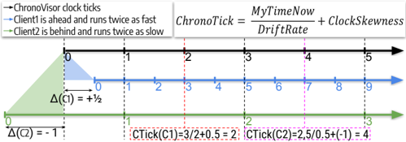

*Fig. 6. Modeling Clock Uncertainty with ChronoTicks.*

 These two observations are encapsulated into a clock uncertainty model. It is not expected that two clocks will 'tell' the same time or run at the same rate. Since ChronoLog relies on the physical time to identify events, simply attaching the actual timestamp from the client-side would not work. Additionally, it is not realistic to expect all clients to synchronize their clocks with the ChronoLog cluster before they use it. ChronoLog handles the clock uncertainty in two ways. First, it requires all participating server nodes in a cluster to synchronize their clocks with the ChronoVisor, which acts as the master global clock. This synchronization happens in the initialization and periodically afterwards. Second, since ChronoLog does not require clients to change their clocks to the ChronoVisor's time, then a new way is needed to 'tell' the same time across decoupled remote machines. This is achieved by the ChronoTicks that model the time as a relative distance from a base clock. Figure 6 shows how this works. The darkest timeline is that of the ChronoVisor, and the one the rest of the cluster is ticking by. The blue timeline is a client that is running ahead by half a time unit (e.g., say seconds in this example) and runs twice as fast. The green timeline is a client that is running behind by one time unit and ticks at a rate half as fast as the ChronoVisor. Let us follow an example where the blue client wants to append an event (see red lines). The client will calculate the ChronoTick by dividing his current time by his drift rate and add his clock distance from that of the ChronoVisor. ChronoTicks ensure that all involved parties speak the same 'time language'. Note that clients just need the base clock and its ticking rate to calculate their own distance and drift rate.

### 2. Handling Backdated Events

Due to the nondeterminism inherent in all distributed systems, an event with a certain ChronoTick may arrive later, mostly due to network latency, violating the immutability property of a log (i.e., event becomes backdated). Since time cannot be rewound, chronicles cannot be mutated. To address this limitation, the ChronoKeeper defines an Acceptance Time Window (ATW) within each chronicle acquisition period. ATW is practically a moving window on the timeline that each chronicle acquisition imposes. An ATW is equal to twice the network latency between the client and the ChronoKeeper. This latency can be measured during client connection or chronicle acquisition (whichever is longer). The ChronoKeeper accepts events with ChronoTicks no earlier than acquisition time or current time minus the ATW, ensuring the chronicle's ordering requirement. If an event arrives with a ChronoTick outside the ATW, it will be rejected, and the client will retry with a new ChronoTick.

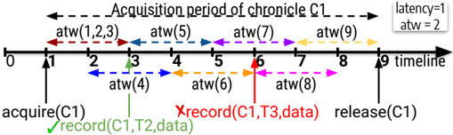

*Fig. 7. ChronoKeeper Event Acceptance Time Window (ATW).*

 Figure 7 shows an example of two record calls. The first (green) arrives at T3 with ChronoTick T2, which falls within the ATW, and succeeds. The second (red), however, arrives at T6 with a ChronoTick T3, which falls outside its ATW, and fails. Finally, the duration of an ATW is also the lower bound of the time an event will stay in the backlog before it can be safely evicted from the ChronoKeeper's NVMe drives.

### 3. Handling Event Collision

Each chronicle has an indexing granularity expressed in a time unit (e.g., seconds). This represents how events are placed in a chronicle. For finer indexing granularity (e.g., default is nanoseconds), events are expected to fall in different ChronoTicks. However, for coarser granularities, events might start to collide on the same ChronoTick. This may happen within the same chronicle acquisition period. There are two challenges associated with event collisions: a) detecting a collision, and, b) correcting a collision. The ChronoKeeper handles both. Detection happens within an acceptance time window. Clients might have attached the same ChronoTick, and thus the colliding events will be hashed to the same ChronoKeeper server which can then detect any collisions. Four semantics are defined to handle those event collisions. Those semantics are set in the chronicle tags during creation, reflecting different chronicle behaviors, and cannot be edited later. During an acquisition, the ChonoVisor passes those tags to the ChronoKeeper defining the collision policy. Figure 8 demonstrates these semantics.
- a) Semantic A: the server will link all events in a serverarrival-time order. When requesting this ChronoTick, the server will return, not one, but all events. This semantic can be used for idempotent workloads.
- b) Semantic B: the server will only place in the chronicle the event that arrived the last. When requesting this ChronoTick, the server will return only one event. This semantic reflects workloads that push events for redundancy.
- c) Semantic C: the server will place the event that arrived first and reject the others. Therefore, clients will retry with a new ChronoTick. This semantic provides more control to the user, ensuring absolute ordering.
- d) Semantic D: the server will place the event that arrived first to the requested ChronoTick and the remaining event(s) to the next available slot(s). This is for workloads that require sequentiality while processing the entire log.

## F. Design Implications and Other Considerations

### 1. Storage Resource Elasticity

Resizing a ChronoLog cluster is possible with a minor caveat. Due to the data streaming approach, both ChronoGrapher and ChronoPlayer have been shown to be elastic.

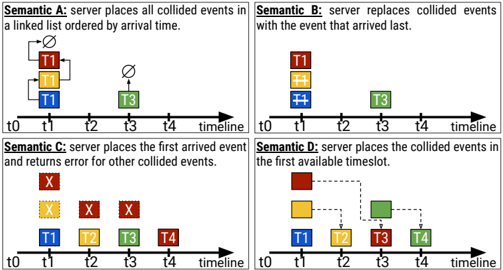

*Fig. 8. Event collision detection and semantics.*

 However, adding more servers to the ChronoKeeper is not suggested since it will incur a rehashing of all keys, and, therefore, data movements. This should only happen by the admins during downtime.

### 2. Chronicle Migration

Moving a chronicle from one ChronoLog cluster to another is not trivial like moving a file from one file system to another. It requires synchronization between the source and destination ChronoVisors. When a chronicle is created, a base value is attached to it by the ChronoVisor. Since ChronoTicks represent a distance from a base value, when migrating a chronicle, the destination ChronoVisor needs to calculate its distance and drift rate from the source ChronoVisor. The clients will receive these values upon connect, and calculating a ChronoTick will point to the correct slot.
### 3. Fault Tolerance

Fault tolerance in ChronoLog is offered via replication. If required, the client must enable this flag during the chronicle creation. Since events cannot be replicated (this implies the same ChronoTick), ChronoLog will create additional chronicle IDs that are not visible to the user. Recorded events will be automatically written to both the primary and all associated chronicle replicas.

## IV. EVALUATION

## A. Methodology

### 1. Testbed

All tests were conducted on the Ares cluster [[79]](#ref-79) at Illinois Tech, which was built to enable multi-tiered storage research. Each compute node has a dual Intel(R) Xeon Scalable Silver 4114 and 96 GB RAM whereas each storage node has a dual AMD Opteron 2384 @ 2.7Ghz and 32GB RAM. The entire cluster is interconnected by a 40GBit Ethernet network with RoCE enabled. Each compute node is equipped with both a fast NVMe PCIe x8 drive and a SATA M.2 SSD. Each storage node has a SATA SSD and a traditional HDD. The total experimental cluster consists of 24 client nodes, 8 dedicated NVMe nodes, and 32 storage nodes.

### 2. Prototype implementation

Our ChronoLog prototype implementation[^1] is written in C++ summing up to 20K lines of code. For the persistent Key-Value Store deployed on the SSDs we used our own implementation using HCL and for the PFS we used OrangeFS 2.9.7. As stated earlier, ChronoKeeper data structures were built using the HCL library. Further, ChronoGrapher and ChronoPlayer were built as a data streaming job implemented using Apache Flink 1.9.2.

[^1]: https://bitbucket.org/scs-io/chronolog

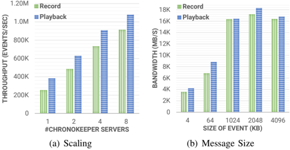

*Fig. 9. ChronoKeeper Performance and Scaling.*

### 3. Workloads and Metrics

We have developed our own microbenchmark that generates log-based workloads to stress-test ChronoLog and its components in isolation. Additionally, we have used three real application workloads: a key-value store (KVS) built on top of a log, a state-machine replication (SMR), and a time series (TS) analysis kernel. All tests were conducted using the maximum scale of 960 client processes. All test have been performed 10 times and we report the average results. The metrics used are logging rates expressed in events per second, achieved bandwidth expressed in MB per second, and execution time in seconds.

## B. ChronoLog Component Analysis

To test ChronoLog's design, we run a series of tests to identify potential bottlenecks within each component of the system.

### 1. ChronoKeeper

To test the ability of the ChronoKeeper to quickly service tail operations, we perform two tests. In the first test shown in Figure 9(a), each of the 1024 clients issue 32K requests of 4KB size each, for a total I/O traffic of 128GB. We scale the number of ChronoKeeper servers from one to eight to see how well it scales. Each server has four threads that manage one NVMe device. As it can be seen in the figure, the ChronoKeeper scales quite linearly. Record throughput reaches more than 900K events/sec for the largest scale tested, while playbacks surpass the 1M events/sec. Both record and playback are lock-free and their slight difference in performance stems from the capability of the hardware itself (i.e., higher read BW). In the second test shown in Figure 9(b), we test how the event size affects the bandwidth extracted from eight ChronoKeeper servers. The total I/O size was kept at 128GB but we scaled the event size each client issues (i.e., 32K requests of 4KB, 4K requests of 64KB, etc.). As it can be seen, as the event size increases, the achieved bandwidth improves with records reaching their saturation point (i.e., around 1MB) sooner than for playbacks (i.e., around 2MB). The bandwidth in this case is directly bound by the NVMe devices as there is no synchronization in these two operations.
### 2. ChronoGrapher

To evaluate the ChronoGrapher's ability to quickly absorb events from the ChronoKeeper and persist them into stories in the bottom tiers of the hierarchy we perform two tests.

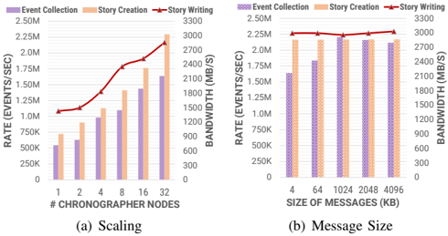

*Fig. 10. ChronoGrapher Performance and Scaling.*

 In the first test shown in Figure 10(a), we scale the ChronoGrapher's deployment from one node up to 32. Each ChronoGrapher server has 6 threads that are used for the three DAG nodes in the streaming job. We use 16 nodes for the persistent KVS and all 32 storage nodes for the PFS. Each client issues 32K requests of 4KB size each, for a total 128GB I/O size among the 1024 participating clients. We observe that event collection improves as we increase the number of collector processes as more data can be pulled from the journal in ChronoKeeper. Since the journal with eight NVMe drives can offer a rate of 1M records per second, increasing the number of collectors past two per NVMe drive (i.e., 16 in total) will not benefit performance much. A matching of production and consumption rates has been achieved. We can also observe that story creation, since it is purely a computation phase where no data is moved, can benefit from more available processes. The running sort algorithm implemented is parallel, and, thus the rate of creating stories is increased with more available threads. Lastly, story writing bandwidth is determined by the performance of the parallel writers on top of the PFS. In our test, stories are written sequentially using MPI collective I/O and 32 ChronoGrapher servers achieve almost the max performance of our PFS (i.e., around 3GB/sec). In the second test shown in Figure 10(b), we test how the event size affects the ChronoGrapher's performance using all 32 servers. The deployment is the same but we change the size of the events collected and persisted from 4KB to 4MB while keeping the overall I/O size to 128GB among all clients. As it can be seen, the ChronoGrapher's bandwidth is not affected since stories are created by a size granularity and not by the number of events in them. Hence, the ChronoGrapher's overall throughput remains stable.

### 3. ChronoPlayer

Similarly, we perform two tests to evaluate the ChronoPlayer's scalability and performance to service historical reads. The deployment of the ChronoPlayer is the same as the previous test with 16 KVS and 32 PFS daemons. In the first test shown in Figure 11(a), we scale the number of ChronoPlayer servers from one to 32. Each client issues 32K replay calls of 4KB range (i.e., each replay fetches one event). As it can be seen, when we increase the number of servers, the listeners' queuing capabilities increase linearly. The resolvers are purely a computation task and therefore more processes can parallelize the work and boost their rate proportionally.

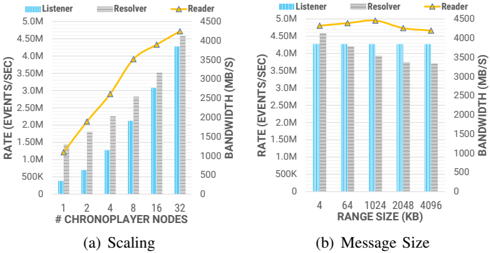

*Fig. 11. ChronoPlayer Performance and Scaling.*

 More interestingly, the overall bandwidth of the ChronoPlayer is mostly determined by the performance of its reader processes and their ability to fetch data from the PFS in parallel. Results show clearly that we were able to scale the read bandwidth quite linearly up to the PFS max read performance of around 4GB/s. In the second test shown in Figure 11(b), we scale the size of the replay calls (i.e., event range) and measure the rate of all 32 ChronoPlayer servers. The overall I/O size we replay is kept the same at 128GB. We observe that, the change of the replay size does not affect the listeners' performance since the request is still 16-bytes long (i.e., msg size in the queue). The resolvers' performance decreases slightly since the replay size increase reflects a bigger event range, and, thus more sub-ranges and deduplications. However, it maintains a high resolving rate of more than 3 million events/sec and it is not the bottleneck. Lastly, as all replay ranges are broken down to sub-ranges based on a 'good' read granularity (e.g., every 4MB), the performance of the readers is consistent across different replay sizes.

### 4. Event Journey Analysis

Since ChronoLog's architecture is decoupled and multi-tiered, observing where the system spends the most time during its operations is quite challenging. To better understand the system's behavior, we instrumented the source code with time measurements on each ChronoLog component. In Figure 12 we demonstrate the journey of an event throughout the entire system. We issued 32K record calls and we measure the individual time spent by an event through each part of the recording. We present the average time each step took as a percentage of the overall end-to-end time. Here end-to-end reflects the entire event journey: starting from the ChronoKeeper and its journal, through the ChronoGrapher, and all the way to a story on the PFS HDDs. We observe that the majority of the time (i.e., 84%) is spent in the ChronoGrapher which is a continuous process of collecting events, sorting them, and writing them to the HDDs. However, this is all happening in the background and clients do not see this cost. A record call can exit once the event is recorded to the ChronoKeeper's journal. This effectively completes in only 16% of the overall end-to-end time. In summary, the heaviest operations are the ones involving data such as the journal insertion with 14%, the KVS insertion 21%, and writing to the PFS with 41%.

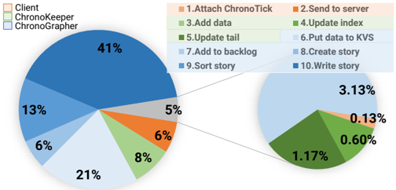

*Fig. 12. Event Journey Performance Analysis.*

## C. Benchmarks and Applications

The analysis presented in the previous subsection IV-B revealed that ChronoLog's design can perform well with artificial workloads. In this subsection we evaluate ChronoLog with real log workloads and compare it with both Bookkeeper and Corfu as well as TimeScaleDB for time series queries.

### 1. Stress Test

In this first test, we perform a stress test for all solutions. To compare apples-to-apples, we run all systems on 8 servers equipped with NVMe devices. For ChronoLog this practically means ChronoKeeper performance. We used 1024 clients that issue append and tail-read requests of various sizes, but for a total I/O size of 128GB, and we measure the achieved bandwidth in MB/s. Note that the NVMe drives perform better for read operations by specification. Results are shown in Figure 13. As it can be seen, ChronoLog outperforms both Bookkeeper and Corfu, but for different reasons. For Bookkeeper, append performance is determined by a single server that is responsible for the active ledger (i.e., log partition). Tail-read performance can be implicitly parallel since multiple clients process the log at different offsets so more ledgers might be used. However, it is still not an explicitly parallel access model. In contrast, Corfu parallelizes all tail accesses, and, thus is able to achieve higher bandwidth. It is, however, still limited by the performance of its centralized sequencer. Append bandwidth reached 4 GB/s which is 2x faster than Bookkeeper but quite lower than the 18 GB/s the 8 eight NVMe drives can achieve if saturated well. Tail-reads seem to be able to perform around 11 GB/s since the sequencer is not involved. However, Corfu uses client synchronization epochs that limit its tail-read bandwidth due to the increased latency. This test highlights the effect of the importance of locating the tail without expensive synchronizations. ChronoLog achieves this using physical time, with its ChronoTicks, and, therefore can perform higher with 16 GB/s record and 18 GB/s playback bandwidth.

### 2. Key-Value Store

In this test, we evaluate the achieved operation throughput of a key-value store implemented on top of a log. We use the native KVS implementations for both competitive log stores: Bookkeeper Table Service [[80]](#ref-80), and CorfuDB [[81]](#ref-81). For ChronoLog we implemented our own key-value store that simply maps a key to a chronicle event. ChronoLog is deployed as follows: the ChronoKeeper runs on 8 NVMe drives with 4 threads on each server, the ChronoStore uses 16 SSD and 32 PFS daemons

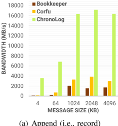

*Fig. 13. Evaluation of Log-Tail Operations.*

 with both ChronoGrapher and ChronoPlayer running on 32 servers. Since none of the other log stores tested are multi-tiered, and, in order to keep the comparison fair, we allocated the same 56 total number of drives (i.e., 8 NVMe, 16 SSD, and 32 HDD) and used their default configurations. We run two workloads: a) each client pushes 32K put() calls of 4KB each and then gets all keys back sequentially, and b) each client puts and immediately gets back keys of 4KB and does so 32K times. For ChronoLog we tested two configurations with and without the backlog enabled. When the backlog is disabled events are moved from higher tiers to lower ones whereas when it is enabled events are copied but not removed from the tier allowing a 'caching' effect.

Results are presented in Figure 14. We can make the following observations. First, both Bookkeeper and Corfu achieve a put() rate less than 100K operations per second for two main reasons: a) their append performance is bound from the active ledger or sequencer bandwidth (as shown earlier), and b) they are not designed to properly utilize multiple tiers of storage which leads to underutilizing NVMe drives, and, thus mostly getting HDD performance. In contrast, ChronoLog reaches more than a 1M operations per second since it always appends events to the ChronoKeeper (i.e., NVMe) and does not use any centralized syncrhonization point. Activating the backlog reduces the put() rate by 18% since more work is needed for a record() call to complete. Second, for get() operations in the first workload, both Bookkeeper and Corfu perform quite well. Sequentially reading the entire log that holds all the keys is a workload that is quite favorable to their designs for different reasons: a) for Bookkeeper, there is implicit parallelism with no contention since many ledgers are spread on all servers, and b) for Corfu, there is no need to use the sequencer since the clients know the log sequence number and simply get the key. In contrast, for ChronoLog, when backlog is disabled all events are moved to the bottom tiers automatically and most get() calls will hit the HDDs. When backlog is enabled, most keys will be found in the upper tiers of the storage hierarchy, and, thus extract a higher bandwidth. For the second workload, where get() calls arrive right after the put(), a lot of contention is introduced for all log stores and put rates are thus reduced. For ChronoLog, however, all get() (i.e., playbacks) will hit the ChronoKeeper. Hence, it achieves significantly higher performance (i.e., NVMe bandwidth).

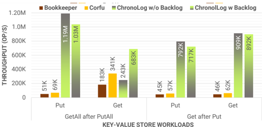

*Fig. 14. Evaluation of Key-Value Store Operations.*

### 3. State Machine Replication (SMR)

In this test, all systems have the same deployment as the previous experiment.

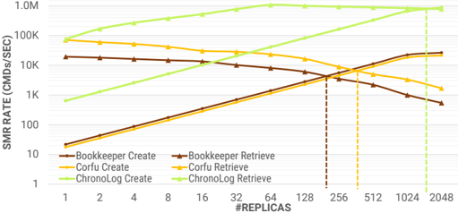

*Fig. 15. SMR Throughput Analysis (Y-axis is in log scale).*

 We test the ability of all log stores to effectively provide a fast store for replicated state machines (SMR). In this application, each client appends a command set of 4KB into the log and then it reads all events that contain the command sets from all other processes. The log offers the total ordering helping to reach consensus of what command to execute next. As the number of replicas increases, more and more data are pushed to the log and creating and retrieving SMRs will eventually saturate. Figure 15 demonstrates the results. We compare the number of replicas each log store can support (i.e., create and retrieve lines are met). As it can be seen, for all three systems the create() rate increases as we add more replicas. Since each log store performs differently for appends, the rates differ with ChronoLog being able to push close to 1M commands per second. On the other hand, the retrieve rate decreases with more replicas since the SMRs get bigger, and, thus more commands have to be retrieved. The main difference between Bookkeeper, Corfu, and ChronoLog is the operation parallelism. In the former two, the clients are actually retrieving from the log whereas for ChronoLog, the ChronoPlayer is able to parallelize the replay() calls and perform deduplication of the requested chronicle ranges reducing the amount of data read. Practically, the ChronoPLayer servers are replaying the log and broadcast the contents to all SMR clients. Bookkeeper was able to saturate the SMR throughput around 200 replicas while Corfu around 380. In contrast, ChronoLog achieves a higher SMR throughput of approximately 1900 replicas making it 5x faster.

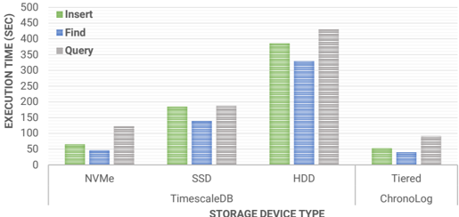

*Fig. 16. Time Series Analysis using TSBS.*

### 4. Time Series Kernel

In this last test, we compare ChronoLog with TimeScaleDB, a popular time series database. We run the widely used Time Series Benchmark Suite (TSBS) [[82]](#ref-82). The benchmark inserts, finds, and queries the data in 4MB data ranges of 4KB events calculating Min, Max, and Average values. This is a single node test with TimeScaleDB deployed on all types of storage devices available to the node (i.e., NVMe, SSD, HDD). It is configured to use 40 workers while ChronoLog uses 1 ChronoKeeper server, 1 SSD KVS, 1 HDD daemon, and 32 ChronoGrapher and ChronoPlayer servers. As it can be seen in Figure 16, TimeScaleDB greatly benefits by the NVMe bandwidth and random access capabilities of the drive whereas performance gets a big hit when running on top of HDD. However, since ChronoLog is designed to leverage the hierarchical storage environment, it performs up to 25% faster than TimeScaleDB stemming from the fact that the chronicle is already indexed by physical time and stored in all available devices.

## V. CONCLUSION AND FUTURE WORK

The rise of activity (or log) data in modern applications expects a distributed shared log store that is capable to scale well. Multi-tiered storage designs are the norm, not the exception, and modern storage software stacks need to be elevated to take advantage of the new types of storage devices and offer superior performance. We present ChronoLog, a new, distributed, shared, and tiered log store that utilizes physical time to order and distribute data both horizontally in multiple nodes but also vertically in multiple tiers. ChronoLog adopts a truly hierarchical design and a decoupled architecture, that is elastic, to match the I/O production and consumption rates. Evaluation results show that eliminating a centralized synchronization point can boost performance to new highs. ChronoLog can achieve millions of tail operations per second and can outperform existing log stores by an order of magnitude.

Several future steps remain to be designed and executed. We plan to investigate deeply the performance characteristics of ChronoLog under different workloads and further evaluate geo-distribution of chronicles. More evaluation is required to model the effects of using physical time to order events. Lastly, we plan to investigate how streaming, SQL, MapReduce, and Deep Learning applications can leverage ChronoLog as their storage back-end.

## REFERENCES

[1] J. Gantz and D. Reinsel, 'The digital universe in 2020: Big data, bigger digital shadows, and biggest growth in the far east,' 2012.

[2] 'The Digitization of the World From Edge to Core,' https://www.seagate.com/files/www-content/our-story/trends/files/idcseagate-dataage-whitepaper.pdf, Accessed: 2020-1-18.

[3] C. Boja, A. POCOVNICU, and L. BATAGAN, 'Distributed parallel architecture for big data[j],' Informatica Economica , vol. 16, pp. 116127, 01 2012.

[4] J. Tan, X. Pan, S. Kavulya, R. Gandhi, and P. Narasimhan, 'Salsa: Analyzing logs as state machines.' WASL , vol. 8, pp. 6-6, 2008.

[5] A. Rabkin and R. Katz, 'Chukwa: A system for reliable large-scale log collection,' in Proceedings of LISA10: 24th Large Installation System Administration Conference , 2010, p. 163.

[6] 'Scribe: Transporting petabytes per hour via a distributed, buffered queueing system,' https://engineering.fb.com/data-infrastructure/scribe/, Accessed: 2020-1-19.

[7] F. Nawab, V. Arora, D. Agrawal, and A. El Abbadi, 'Chariots: A scalable shared log for data management in multi-datacenter cloud environments.' in EDBT , 2015, pp. 13-24.

[8] M. Shapiro, N. Preguic ¸a, C. Baquero, and M. Zawirski, 'A comprehensive study of convergent and commutative replicated data types,' 2011.

[9] P. A. Bernstein, C. W. Reid, and S. Das, 'Hyder-a transactional record manager for shared flash.' in CIDR , vol. 11, 2011, pp. 9-20.

[10] A. K. Goel, J. Pound, N. Auch, P. Bumbulis, S. MacLean, F. F¨ arber, F. Gropengiesser, C. Mathis, T. Bodner, and W. Lehner, 'Towards scalable real-time analytics: An architecture for scale-out of olxp workloads,' Proceedings of the VLDB Endowment , vol. 8, no. 12, pp. 17161727, 2015.

[11] M. Balakrishnan, D. Malkhi, T. Wobber, M. Wu, V. Prabhakaran, M. Wei, J. D. Davis, S. Rao, T. Zou, and A. Zuck, 'Tango: Distributed data structures over a shared log,' in Proceedings of the Twenty-Fourth ACM Symposium on Operating Systems Principles , 2013, pp. 325-340.

[12] M. Bevilacqua-Linn, M. Byron, P. Cline, J. Moore, and S. Muir, 'Sirius: distributing and coordinating application reference data,' in 2014 USENIX Annual Technical Conference (ATC 14) , 2014, pp. 293304.

[13] A. Thomson and D. J. Abadi, 'Calvinfs: Consistent { WAN } replication and scalable metadata management for distributed file systems,' in 13th { USENIX } Conference on File and Storage Technologies ( { FAST } 15) , 2015, pp. 1-14.

[14] M. Wei, C. Rossbach, I. Abraham, U. Wieder, S. Swanson, D. Malkhi, and A. Tai, 'Silver: a scalable, distributed, multi-versioning, always growing (ag) file system,' in 8th { USENIX } Workshop on Hot Topics in Storage and File Systems (HotStorage 16) , 2016.

[15] A. Hogan, A. Harth, J. Umrich, and S. Decker, 'Towards a scalable search and query engine for the web,' in Proceedings of the 16th international conference on World Wide Web , 2007, pp. 1301-1302.

[16] Y. Lei, V. Uren, and E. Motta, 'Semsearch: A search engine for the semantic web,' in International conference on knowledge engineering and knowledge management . Springer, 2006, pp. 238-245.

[17] K. Hazelwood, S. Bird, D. Brooks, S. Chintala, U. Diril, D. Dzhulgakov, M. Fawzy, B. Jia, Y. Jia, A. Kalro et al. , 'Applied machine learning at facebook: A datacenter infrastructure perspective,' in 2018 IEEE International Symposium on High Performance Computer Architecture (HPCA) . IEEE, 2018, pp. 620-629.

[18] V. Agarwal, F. Petrini, D. Pasetto, and D. A. Bader, 'Scalable graph exploration on multicore processors,' in SC'10: Proceedings of the 2010 ACM/IEEE International Conference for High Performance Computing, Networking, Storage and Analysis . IEEE, 2010, pp. 1-11.

[19] F. Checconi, F. Petrini, J. Willcock, A. Lumsdaine, A. R. Choudhury, and Y. Sabharwal, 'Breaking the speed and scalability barriers for graph exploration on distributed-memory machines,' in SC'12: Proceedings of the International Conference on High Performance Computing, Networking, Storage and Analysis . IEEE, 2012, pp. 1-12.

[20] J. Gray, P. McJones, M. Blasgen, B. Lindsay, R. Lorie, T. Price, F. Putzolu, and I. Traiger, 'The recovery manager of the system r database manager,' ACM Computing Surveys (CSUR) , vol. 13, no. 2, pp. 223-242, 1981.

[21] F. Nawab, D. Agrawal, and A. El Abbadi, 'Message futures: Fast commitment of transactions in multi-datacenter environments.' in CIDR , 2013.

[22] R. Haskin, Y. Malachi, and G. Chan, 'Recovery management in quicksilver,' ACM Transactions on Computer Systems (TOCS) , vol. 6, no. 1, pp. 82-108, 1988.

[23] F. B. Schneider, 'Implementing fault-tolerant services using the state machine approach: A tutorial,' ACM Computing Surveys (CSUR) , vol. 22, no. 4, pp. 299-319, 1990.

[24] A. H. Hormati, Y. Choi, M. Kudlur, R. Rabbah, T. Mudge, and S. Mahlke, 'Flextream: Adaptive compilation of streaming applications for heterogeneous architectures,' in 2009 18th International Conference on Parallel Architectures and Compilation Techniques . IEEE, 2009, pp. 214-223.

[25] O.-C. Marcu, A. Costan, G. Antoniu, M. P´ erez-Hern´ andez, B. Nicolae, R. Tudoran, and S. Bortoli, 'Kera: Scalable data ingestion for stream processing,' in 2018 IEEE 38th International Conference on Distributed Computing Systems (ICDCS) . IEEE, 2018, pp. 1480-1485.

[26] M. H. Iqbal and T. R. Soomro, 'Big data analysis: Apache storm perspective,' International journal of computer trends and technology , vol. 19, no. 1, pp. 9-14, 2015.

[27] S. Chintapalli, D. Dagit, B. Evans, R. Farivar, T. Graves, M. Holderbaugh, Z. Liu, K. Nusbaum, K. Patil, B. J. Peng et al. , 'Benchmarking streaming computation engines: Storm, flink and spark streaming,' in 2016 IEEE international parallel and distributed processing symposium workshops (IPDPSW) . IEEE, 2016, pp. 1789-1792.

[28] M. Ji, A. C. Veitch, J. Wilkes et al. , 'Seneca: remote mirroring done write.' in USENIX Annual Technical Conference, General Track , 2003, pp. 253-268.

[29] L. Lamport, D. Malkhi, and L. Zhou, 'Vertical paxos and primarybackup replication,' in Proceedings of the 28th ACM symposium on Principles of distributed computing , 2009, pp. 312-313.

[30] J. Baker, C. Bond, J. C. Corbett, J. Furman, A. Khorlin, J. Larson, J.M. Leon, Y. Li, A. Lloyd, and V. Yushprakh, 'Megastore: Providing scalable, highly available storage for interactive services,' 2011.

[31] N. H. Chan, Time series: applications to finance . John Wiley &amp; Sons, 2004, vol. 487.

[32] R. S. Tsay, Analysis of financial time series . John wiley &amp; sons, 2005, vol. 543.

[33] C. P. Kolovson and M. Stonebraker, 'Segment indexes: Dynamic indexing techniques for multi-dimensional interval data,' ACM SIGMOD Record , vol. 20, no. 2, pp. 138-147, 1991.

[34] A. Berson and S. J. Smith, Data warehousing, data mining, and OLAP . McGraw-Hill, Inc., 1997.

[35] P. Jonsson and L. Eklundh, 'Seasonality extraction by function fitting to time-series of satellite sensor data,' IEEE transactions on Geoscience and Remote Sensing , vol. 40, no. 8, pp. 1824-1832, 2002.

[36] S. Newman, Building microservices: designing fine-grained systems . ' O'Reilly Media, Inc.', 2015.

[37] N. Dragoni, S. Giallorenzo, A. L. Lafuente, M. Mazzara, F. Montesi, R. Mustafin, and L. Safina, 'Microservices: yesterday, today, and tomorrow,' in Present and ulterior software engineering . Springer, 2017, pp. 195-216.

[38] J. Bhimani, J. Yang, Z. Yang, N. Mi, Q. Xu, M. Awasthi, R. Pandurangan, and V. Balakrishnan, 'Understanding performance of i/o intensive containerized applications for nvme ssds,' in 2016 IEEE 35th International Performance Computing and Communications Conference (IPCCC) . IEEE, 2016, pp. 1-8.

[39] J. Kreps, N. Narkhede, J. Rao et al. , 'Kafka: A distributed messaging system for log processing,' in Proceedings of the NetDB , 2011, pp. 1-7, http://pages.cs.wisc.edu/ akella/CS744/F17/838-CloudPapers/Kafka.pdf.

[40] F. P. Junqueira, I. Kelly, and B. Reed, 'Durability with bookkeeper,' ACM SIGOPS Operating Systems Review , vol. 47, no. 1, pp. 9-15, 2013.

[41] M. Balakrishnan, D. Malkhi, V. Prabhakaran, T. Wobbler, M. Wei, and J. D. Davis, ' { CORFU } : A shared log design for flash clusters,' in Presented as part of the 9th { USENIX } Symposium on Networked Systems Design and Implementation ( { NSDI } 12) , 2012, pp. 1-14.

[42] P. Matri, P. Carns, R. Ross, A. Costan, M. S. P´ erez, and G. Antoniu, 'Slog: Large-scale logging middleware for hpc and big data convergence,' in 2018 IEEE 38th International Conference on Distributed Computing Systems (ICDCS) . IEEE, 2018, pp. 1507-1512.

[43] N. Watkins, 'ZLog: a distributed shared-log on Ceph,' https://nwat.xyz/blog/2014/10/26/zlog-a-distributed-shared-log-onceph/, 2014, Accessed: 2020-1-28.

[44] Y. Liu, J. Peng, and Z. Yu, 'Big data platform architecture under the background of financial technology: In the insurance industry as an
45. example,' in Proceedings of the 2018 International Conference on Big Data Engineering and Technology , 2018, pp. 31-35.

[45] A. Zanella, N. Bui, A. Castellani, L. Vangelista, and M. Zorzi, 'Internet of things for smart cities,' IEEE Internet of Things journal , vol. 1, no. 1, pp. 22-32, 2014.

[46] W. Shi, J. Cao, Q. Zhang, Y. Li, and L. Xu, 'Edge computing: Vision and challenges,' IEEE internet of things journal , vol. 3, no. 5, pp. 637-646, 2016.

[47] 'The Array of things (AoT),' https://www.anl.gov/mcs/array-of-things, 2018, Argonne National Lab, University of Chicago, Accessed: 20201-28.

[48] K. Su, J. Li, and H. Fu, 'Smart city and the applications,' in 2011 international conference on electronics, communications and control (ICECC) . IEEE, 2011, pp. 1028-1031.

[49] B. Xu, L. Da Xu, H. Cai, C. Xie, J. Hu, and F. Bu, 'Ubiquitous data accessing method in iot-based information system for emergency medical services,' IEEE Transactions on Industrial informatics , vol. 10, no. 2, pp. 1578-1586, 2014.

[50] C. L. Borgman, J. C. Wallis, M. S. Mayernik, and A. Pepe, 'Drowning in data: digital library architecture to support scientific use of embedded sensor networks,' in Proceedings of the 7th ACM/IEEE-CS joint conference on Digital libraries , 2007, pp. 269-277.

[51] C. Wu, R. Tobar, K. Vinsen, A. Wicenec, D. Pallot, B. Lao, R. Wang, T. An, M. Boulton, I. Cooper et al. , 'Daliuge: A graph execution framework for harnessing the astronomical data deluge,' Astronomy and computing , vol. 20, pp. 1-15, 2017.

[52] N. Conway, P. Alvaro, E. Andrews, and J. M. Hellerstein, 'Edelweiss: Automatic storage reclamation for distributed programming,' Proceedings of the VLDB Endowment , vol. 7, no. 6, pp. 481-492, 2014.

[53] F. Nawab, V. Arora, D. Agrawal, and A. El Abbadi, 'Minimizing commit latency of transactions in geo-replicated data stores,' in Proceedings of the 2015 ACM SIGMOD International Conference on Management of Data , 2015, pp. 1279-1294.

[54] S. Patterson, A. J. Elmore, F. Nawab, D. Agrawal, and A. E. Abbadi, 'Serializability, not serial: Concurrency control and availability in multidatacenter datastores,' arXiv preprint arXiv:1208.0270 , 2012.

[55] H. T. Vo, S. Wang, D. Agrawal, G. Chen, and B. C. Ooi, 'Logbase: a scalable log-structured database system in the cloud,' arXiv preprint arXiv:1207.0140 , 2012.

[56] J. Lockerman, J. M. Faleiro, J. Kim, S. Sankaran, D. J. Abadi, J. Aspnes, S. Sen, and M. Balakrishnan, 'The fuzzylog: A partially ordered shared log,' in 13th { USENIX } Symposium on Operating Systems Design and Implementation ( { OSDI } 18) , 2018, pp. 357-372.

[57] A. Thomson, T. Diamond, S.-C. Weng, K. Ren, P. Shao, and D. J. Abadi, 'Calvin: fast distributed transactions for partitioned database systems,' in Proceedings of the 2012 ACM SIGMOD International Conference on Management of Data , 2012, pp. 1-12.

[58] M. I. Seltzer, 'Transaction support in a log-structured file system,' in Proceedings of IEEE 9th International Conference on Data Engineering , April 1993, pp. 503-510.

[59] S. Guo, R. Dhamankar, and L. Stewart, 'Distributedlog: A high performance replicated log service,' in 2017 IEEE 33rd International Conference on Data Engineering (ICDE) . IEEE, 2017, pp. 1183-1194.

[60] E. Renart, D. Balouek-Thomert, and M. Parashar, 'Pulsar: Enabling dynamic data-driven iot applications,' in 2017 IEEE 2nd International Workshops on Foundations and Applications of Self* Systems (FAS* W) . IEEE, 2017, pp. 357-359.

[61] D. Malkhi, M. Balakrishnan, J. D. Davis, V. Prabhakaran, and T. Wobber, 'From paxos to corfu: a flash-speed shared log,' ACM SIGOPS Operating Systems Review , vol. 46, no. 1, pp. 47-51, 2012.

[62] M. Wei, J. D. Davis, T. Wobber, M. Balakrishnan, and D. Malkhi, 'Beyond block i/o: implementing a distributed shared log in hardware,' in Proceedings of the 6th International Systems and Storage Conference , 2013, pp. 1-11.

[63] M. Wei, A. Tai, C. J. Rossbach, I. Abraham, M. Munshed, M. Dhawan, J. Stabile, U. Wieder, S. Fritchie, S. Swanson et al. , 'vcorfu: A cloudscale object store on a shared log,' in 14th { USENIX } Symposium on Networked Systems Design and Implementation ( { NSDI } 17) , 2017, pp. 35-49.

[64] M. P. Herlihy and J. M. Wing, 'Linearizability: A correctness condition for concurrent objects,' ACM Trans. Program. Lang. Syst. , vol. 12, no. 3, p. 463492, Jul. 1990. [Online]. Available: https://doi.org/10.1145/78969.78972

[65] J. C. Corbett, J. Dean, M. Epstein, A. Fikes, C. Frost, J. J. Furman, S. Ghemawat, A. Gubarev, C. Heiser, P. Hochschild et al. , 'Spanner: Googles globally distributed database,' ACM Transactions on Computer Systems (TOCS) , vol. 31, no. 3, pp. 1-22, 2013.

[66] A. Kougkas, H. Devarajan, and X.-H. Sun, 'Hermes: A heterogeneousaware multi-tiered distributed i/o buffering system,' in Proceedings of the 27th International Symposium on High-Performance Parallel and Distributed Computing , 2018, pp. 7-8.

[67] S. W. Fong, C. M. Neumann, and H.-S. P. Wong, 'Phase-change memorytowards a storage-class memory,' IEEE Transactions on Electron Devices , vol. 64, no. 11, pp. 4374-4385, 2017.

[68] G. W. Burr, B. N. Kurdi, J. C. Scott, C. H. Lam, K. Gopalakrishnan, and R. S. Shenoy, 'Overview of candidate device technologies for storageclass memory,' IBM Journal of Research and Development , vol. 52, no. 4.5, pp. 449-464, 2008.

[69] Q. Xu, H. Siyamwala, M. Ghosh, T. Suri, M. Awasthi, Z. Guz, A. Shayesteh, and V. Balakrishnan, 'Performance analysis of nvme ssds and their implication on real world databases,' in Proceedings of the 8th ACM International Systems and Storage Conference , 2015, pp. 1-11.

[70] G. Bronevetsky and A. Moody, 'Scalable i/o systems via node-local storage: Approaching 1 tb/sec file i/o,' Lawrence Livermore National Laboratory, Livermore, CA, USA, Tech. Rep. TR-JLPC-09-01 , 2009.

[71] A. Ovsyannikov, M. Romanus, B. Van Straalen, G. H. Weber, and D. Trebotich, 'Scientific workflows at datawarp-speed: accelerated dataintensive science using nersc's burst buffer,' in 2016 1st Joint International Workshop on Parallel Data Storage and data Intensive Scalable Computing Systems (PDSW-DISCS) . IEEE, 2016, pp. 1-6.

[72] A. Kougkas, M. Dorier, R. Latham, R. Ross, and X.-H. Sun, 'Leveraging burst buffer coordination to prevent i/o interference,' in 2016 IEEE 12th International Conference on e-Science (e-Science) . IEEE, 2016, pp. 371-380.

[73] H. Abbasi, M. Wolf, G. Eisenhauer, S. Klasky, K. Schwan, and F. Zheng, 'Datastager: scalable data staging services for petascale applications,' Cluster Computing , vol. 13, no. 3, pp. 277-290, 2010.

[74] J. W. Harris and H. St¨ ocker, Handbook of mathematics and computational science . Springer Science &amp; Business Media, 1998.

[75] 'Hermes Container Library: Distributed Data Structures,' https://github.com/HDFGroup/hcl, Accessed: 2020-2-15.

[76] V. Verroios and H. Garcia-Molina, 'Top-k entity resolution with adaptive locality-sensitive hashing,' in 2019 IEEE 35th International Conference on Data Engineering (ICDE) . IEEE, 2019, pp. 1718-1721.

[77] T. Christiani, 'Fast locality-sensitive hashing frameworks for approximate near neighbor search,' in International Conference on Similarity Search and Applications . Springer, 2019, pp. 3-17.

[78] F. Chang, J. Dean, S. Ghemawat, W. C. Hsieh, D. A. Wallach, M. Burrows, T. Chandra, A. Fikes, and R. E. Gruber, 'Bigtable: A distributed storage system for structured data,' ACM Transactions on Computer Systems (TOCS) , vol. 26, no. 2, pp. 1-26, 2008.

[79] 'Computing resources at Scalable Computing Software Laboratory - The Ares cluster,' http://www.cs.iit.edu/ scs/resources.html, 2020, Illinois Tech, Accessed: 2020-2-12.

[80] 'Bookkeeper Table Service,' https://github.com/apache/bookkeeper/, Accessed: 2020-1-5.

[81] 'CorfuDB: A cluster consistency platform,' https://github.com/CorfuDB/CorfuDB, Accessed: 2020-1-5.

[82] 'Time Series Benchmark Suite, a tool for comparing and evaluating databases for time series data,' https://github.com/timescale/tsbs, Accessed: 2020-1-10.