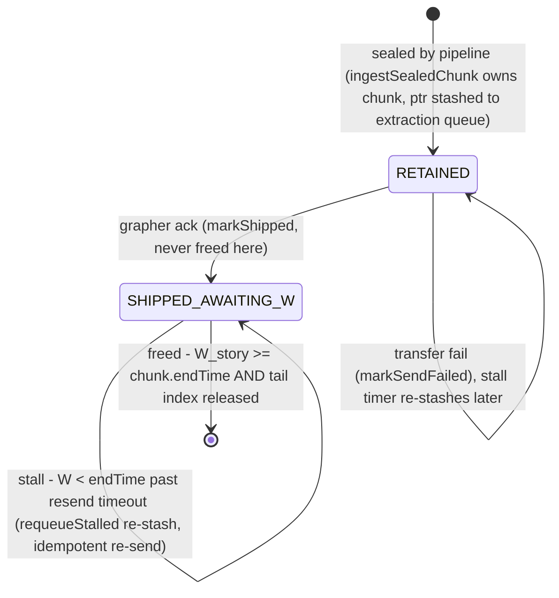

# Watermark Feedback (Keeper ↔ Grapher ↔ Player) Implementation Plan

> **For agentic workers:** REQUIRED SUB-SKILL: Use superpowers:subagent-driven-development (recommended) or superpowers:executing-plans to implement this plan task-by-task. Steps use checkbox (`- [ ]`) syntax for tracking.

**Goal:** Replace ack-based (and currently even ack-*less*) story-chunk deletion in the keeper with durability-gated retention driven by a grapher-published persisted watermark `W`, and make the player split replay at that watermark — fetching events newer than `W` from the keepers instead of from its push-fed mirror.

**Invariant (the heart of correctness):** `E ≤ W` — a keeper never frees a chunk whose events are not confirmed durable in HDF5. Stale watermark views cause only redundant reads (cleaned by `EventSequence` dedup), never data loss.

Decisions confirmed with the user:

1. **W transport: grapher pushes to keepers** — keeper sends its report-target `ServiceId` along with each drained chunk; grapher lazily builds per-keeper one-way report clients and sends coalesced reports.
2. **Hot source for replay: player pulls from keepers on demand** (new keeper RPC); the dual-endpoint push / player mirror is demoted to legacy config.
3. **Failure scope: transient grapher outages only** (retention + stall re-send + bounded-cap warnings). Grapher *restart* recovery is out of scope, documented as a limitation.

## Context — what the code actually does today (verified)

- **Keeper deletes chunks unconditionally — even on failed transfer.** The live drain loop is `StoryChunkExtractionModule::drainExtractionQueue` (`src/chrono-common/include/StoryChunkExtractionModule.h:88-136`): it calls `theExtractionChain.process_chunk(chunk)` — whose per-extractor return codes the chain **ignores** (`src/chrono-keeper/include/KeeperExtractionChain.h:31-37`) — then `delete story_chunk` at `:128` regardless of outcome ("will be addressed in issue #635"). A grapher outage today doesn't just risk the acceptance window; every chunk drained during the outage is silently destroyed.
- **Grapher acks before durability.** `GrapherRecordingService::receive_story_chunk` (`src/chrono-grapher/include/GrapherRecordingService.h:96-101`) responds the byte count *before* `ingestStoryChunk`, then holds events in its pipeline for up to its acceptance window before the HDF5 write.
- **Player's hot/cold split is a clock guess.** `PlayerDataStore::get_active_window_boundary` (`src/chrono-player/src/PlayerDataStore.cpp:351`) returns `now − acceptance_window_secs`; the hot portion is served from a player mirror fed by best-effort `dual_endpoint_rdma_extractor` pushes (a lost push is only logged).
- The branch (`tail-read-from-sealed-chunk`) retains sealed chunks in `KeeperTailStore` (`src/chrono-keeper/include/KeeperTailStore.h`) for tail reads, using *deferred extraction* (chunk goes to the extraction queue only when it ages out of the tail — `enforceCapacity`, `:129-143`). Decoupling deletion from the ack removes that workaround and lets chunks ship on seal.

### ⚠ Dead code — do not touch these (the old draft targeted them)

`chrono_keeper` compiles **only** `ChronoKeeperInstance.cpp`, `ChronoKeeperConfiguration.cpp`, `KeeperStoryPipeline.cpp`, `KeeperDataStore.cpp`, `DualEndpointChunkExtractorRDMA.cpp` (see `src/chrono-keeper/CMakeLists.txt`). These files are **not built** and must not be modified: `src/chrono-keeper/src/StoryChunkExtractor.cpp`, `src/chrono-keeper/src/StoryChunkExtractorRDMA.cpp`, `src/chrono-keeper/include/StoryChunkExtractorRDMA.h`, `src/chrono-keeper/src/CSVFileChunkExtractor.cpp`, `src/chrono-keeper/include/CSVFileChunkExtractor.h` (its `#include <StoryChunkExtractor.h>` header doesn't even exist). The live extractors are `StoryChunkExtractorRDMA` in `src/chrono-common/{include/ChunkExtractorRDMA.h,src/ChunkExtractorRDMA.cpp}`, `DualEndpointChunkExtractorRDMA` (keeper), `StoryChunkExtractorCSV` (chrono-common), all sending via `RDMATransferAgent` (`src/chrono-common/src/RDMATransferAgent.cpp`) → RPC `"receive_story_chunk"`, received by `GrapherRecordingService` (grapher) and `StoryChunkConsumerService` (player, `src/chrono-common/include/StoryChunkConsumerService.h`).

Also: `revamp_design_qa.md` / `revamp_issues_draft.md` are **not in this repo** — no task may reference editing them.

## Architecture

```mermaid
flowchart LR
    subgraph Keeper
        P[KeeperStoryPipeline<br/>seal] -->|"ingestSealedChunk + stash (ship-on-seal)"| RS[(KeeperChunkRetentionStore<br/>owns all sealed chunks)]
        Q[ExtractionQueue<br/>non-owning ptrs] --> M[StoryChunkExtractionModule<br/>drain]
        RS -. stash on seal / re-stash on stall .-> Q
        M -->|dispose_chunk: markShipped / markSendFailed| RS
        ADM[DataStoreAdminService<br/>report_story_watermarks] -->|confirmPersisted W| RS
        REC[KeeperRecordingService<br/>story_range_fetch] -->|fetchRange| RS
    end
    subgraph Grapher
        GRS[GrapherRecordingService<br/>+ reporter ServiceId] --> GP[pipeline<br/>merges all keepers' stripes;<br/>prepends past windows for stragglers]
        GP --> H5[HDF5FileChunkExtractor<br/>write+flush]
        H5 -->|"advancePersisted(start,end)"| REG[(StoryWatermarkRegistry<br/>W = contiguous persisted prefix)]
        REG -->|snapshotDirty| PUB[WatermarkReportPublisher<br/>1s, one-way, per contributing keeper]
    end
    subgraph Player
        PB[PlaybackService] -->|"fan-out story_range_fetch, B = min(hot_floor)"| REC
        PB -->|"[start, min(end,B)) from HDF5"| AR[ArchiveReader]
    end
    M -->|"receive_story_chunk(bulk, reporter ServiceId)"| GRS
    PUB -->|report_story_watermarks| ADM
    V[Visor KeeperRegistry] -->|story start + keeper roster| PB
```



Chunk lifecycle on the keeper (single free condition: **shipped AND `W_story ≥ chunk.endTime` AND tail index no longer references it**):



| Symbol | Meaning | Owner | Storage |
|---|---|---|---|
| `W` | End of the **contiguous prefix** of persisted merged timeline windows for the story: every merged window from story start up to `W` is written+flushed to HDF5 | Grapher | in-memory (restart resets — accepted) |
| `E` | Highest tick up to which a keeper has freed retained chunks (bookkeeping only — eviction is per-chunk, see below) | each Keeper | in-memory, per story |
| hot floor | Oldest event tick still retained in a keeper's store for a story | each Keeper | derived |

## Protocol soundness — when W advances, and why stragglers can't be hurt by it

These rules are the answer to the multi-keeper race ("keeper A's persistence advances W while keeper B's chunk for the same window is still in flight / failed") and the straggler problem. They are load-bearing; the tasks below implement exactly this.

1. **W advances only on persistence of the grapher's *merged* windows, over a contiguous prefix.** The grapher does not persist keeper chunks directly: all keepers' stripes for a story merge into one `StoryPipeline` timeline, whose head window seals only after the *grapher's* acceptance window (180 s default) has passed beyond the window's end — that buffer is the designed absorption time for slow keepers. When the HDF5 extractor persists a merged window `[s,e)`, it calls `advancePersisted(story, s, e)`; the registry records the interval and sets `W` = end of the longest contiguous run of persisted intervals anchored at story start. A plain `max(end)` would be unsound: the grapher's extraction module runs 2 drain streams, so merged windows of one story can persist out of order, and a failed HDF5 write must hold `W` back (keepers then retain + cap-warn — "never lie" beats "never stall").
2. **A keeper frees per chunk, never per story: `acked(shipped) && W ≥ chunk.endTime && tail-released`.** `W` alone frees nothing. If keeper B's chunk failed to transfer (or its ack was lost), B has no `shipped` mark for it, retains it, and re-sends on the stall timer — no matter how far other keepers' data pushed `W`. This is why one keeper's persistence can never cause another keeper's un-delivered data to be dropped. (`E` is derived bookkeeping, not a free trigger.)
3. **Why `acked && W ≥ end` implies durable for a normally-delivered chunk:** the chunk's events were merged into timeline windows `≤ chunk.endTime` *before* those windows sealed (seal happens ≥ acceptance-window after the window end); `W ≥ chunk.endTime` means every merged window covering the chunk persisted (contiguity), so the chunk's events are on disk.
4. **Stragglers (first delivery arrives after W already passed its window) are never silently dropped.** `StoryPipeline::mergeEvents` already *prepends* timeline chunks to extend the timeline into the past and grows the acceptance window (`src/chrono-common/src/StoryPipeline.cpp:339-379`); the re-opened window later seals and persists as an additional rotated HDF5 file (duplicates of already-persisted events possible — read-side `EventSequence` dedup cleans them). The registry ignores persisted intervals below `W` (already covered), so `W` never regresses. The one existing discard path — prepend failure at `:368-377` — is changed to wrap the un-mergeable events into a fresh chunk stashed straight to the extraction queue instead of erasing them (Task 1).
5. **Re-sent chunks whose first delivery succeeded** (lost ack / stall timer) merge into a still-open window where `StoryChunk`'s `map<EventSequence, LogEvent>` deduplicates them in memory for free; if the window already closed, they take the prepend path of rule 4 (duplicate rotated file, deduped on read). There is **no** "discard if `≤ W`" ingest guard: the grapher cannot distinguish a redundant re-send from a straggler's first delivery, so it must ingest both.
6. **Residual risk, accepted per failure scope:** a straggler is acked when received, but its prepended window persists asynchronously (up to the enlarged acceptance window later). Between that ack (+ `W` already ≥ its end) and the rotated-file write, only a grapher *crash* loses it — grapher crash/restart is the explicitly out-of-scope failure (a `kill -STOP`/`-CONT` outage keeps grapher memory intact). Document it; a future hardening can hold reported `W` back below re-opened windows.

### Worked example A — W advance with 3 keepers, one straggler

Two independent chunk-duration knobs are in play, each from its own config block — this is **not** different sizes across keepers:

- **Every keeper** seals 10 s chunks (the keepers' shared `story_chunk_duration_secs` = 10) and ships on seal, ~15 s after each span closes.
- **The grapher** re-buckets everything it receives into its own 30 s merged windows (the grapher's `story_chunk_duration_secs` = 30) and seals a window only after its 60 s acceptance window has passed beyond the window's end.

Story S is striped per event (`tick % 3`) across K1, K2, K3, so each keeper holds a *stripe* of every 10 s span — a keeper chunk like `[20,30)` is that keeper's stripe of the span, not the whole span. For `[0,30)` each keeper seals three chunks — `[0,10)`, `[10,20)`, `[20,30)` — so nine keeper chunks feed the grapher's single merged window `[0,30)`.

```
t~25   All three keepers ship their [0,10) chunks; acked, merged into G's [0,30) window.
t~35   All three ship [10,20); acked, merged.
t~45   K1, K2 ship [20,30); acked, merged.
       K3's [20,30) chunk c3 FAILS to transfer (network blip).
       K3: markSendFailed(c3) -> c3 stays RETAINED. G never saw c3 — its merged
       [0,30) window now holds 8 of the 9 keeper chunks, and G cannot know one
       is missing.
t=90   G seals merged [0,30) (window end 30 + 60 s acceptance). An extraction
       thread persists it.
       registry.advancePersisted(S, 0, 30) -> contiguous from anchor 0 -> W=30.
t=91   G reports {S: W=30} to K1,K2,K3.
       K1,K2 free all three of their chunks: ack && endTime<=30 holds for each.
       K3 frees [0,10) and [10,20) but does NOT free c3:
       W=30 >= c3.end but c3 has NO ACK -> per-chunk gate holds it (rule 2).
t=120  G seals merged [30,60); t=150 G seals merged [60,90). Two extraction
       threads persist them OUT OF ORDER: [60,90) finishes first.
       advancePersisted(S,60,90) -> not contiguous (nothing persisted yet for
       [30,60)) -> W stays 30, interval parked.
       advancePersisted(S,30,60) -> prefix now [0,90) -> W jumps 30->90 in one step.
       (If the [30,60) write had FAILED, W would stay 30 indefinitely and all
        keepers would retain+re-send; cap warning, but never a lie.)
t=400  K3's stall timer re-sends c3. It arrives with W long past 30; G acks on
       receipt.
       G's mergeEvents sees firstEventTime 20 < TimelineStart -> PREPEND path:
       re-opens a past window, merges c3, later persists it as a rotated file
       <chronicle>.<story>.0.1.vlen.h5.
       advancePersisted(S,0,30) again -> end <= W -> ignored; W never regresses.
       Now K3 has ack && W >= c3.end -> frees c3.
```

The key inversion vs. "G waits for all keepers": G *cannot* wait for chunks it doesn't know exist, so it never tries — the acceptance window is the only bounded wait. Anything later takes the prepend path, and the sender is protected the whole time by the per-chunk ack requirement, not by W. W says "everything I have *received and merged* below this tick is on disk"; the ack says "I received it"; the keeper frees only on the conjunction.

### Worked example B — player split (the player never sees E or W)

The player knows only the story's keeper roster (from the visor at story start). Replay request `[0, 300)` at t=310, same group:

```
Player fans story_range_fetch(S, 0, 300, cap) to K1,K2,K3 (full range — keepers
only hold the recent tail, so this is cheap):
  K1 -> events it retains in range, hot_floor=210   (freed everything < 210)
  K2 -> events it retains in range, hot_floor=180   (tail happens to reach further back)
  K3 -> events it retains in range, hot_floor=240

B = min(210, 180, 240) = 180.

Cold side:  archive read queued for [0, min(300, 180)) = [0, 180).
            Sound because each keeper frees a chunk only on ack && W >= end,
            frees proceed oldest-first, so everything below ITS floor is on
            disk; below min() it holds for every stripe.
Hot side:   keeper-returned events, merged into map<EventSequence, LogEvent>
            (cross-keeper dedup free), events with time < B dropped
            (guaranteed archive-covered duplicates), rest -> response.
Overlap:    a chunk persisted but not yet freed shows up in BOTH archive and a
            keeper response -> EventSequence dedup cleans it. Overlap is the
            failure-safe direction; a stale roster or missing keeper response
            only shrinks the hot set and raises B for the others' min.
Degenerate: keeper retains nothing -> hot_floor=UINT64_MAX, drops out of min;
            no keeper responds at all -> B=300, archive-only (degraded, correct
            for persisted data).
```

So it is *not* "query both sides for everything and dedup": the archive read is cut at `B` because the region above `B` may not be on disk at all — the split is a completeness argument, not an optimization. `hot_floor` is each keeper's own consequence of (ack ∧ W); the player needs neither E nor W explicitly.

## Global Constraints

- Build/install/deploy/bench **only** through `tools/deploy/` scripts. Debug build: `tools/deploy/local_single_user_deploy.sh -b -t Debug`; install `-i -t Debug`. Bench binary is `chrono-bench` (from `tools/benchmark/perf_bench.cpp`).
- Before every deploy: `pkill -9 -f "chrono-(visor|keeper|grapher|player) --config"` then `sleep 2`.
- New config keys go into `conf/default_conf.json.in` + `ConfigurationBlocks.{h,cpp}` (source change); never patch a running daemon's installed conf.
- No wire-compat shims: both ends of every changed RPC live in this repo and deploy together. Note `"receive_story_chunk"` has **two** receivers (grapher `GrapherRecordingService`, player `StoryChunkConsumerService`) — change both.
- Do not push branches / open PRs without explicit user approval. Commit locally per task.
- Every task leaves a deployable tree (Task 2 via the auto-confirm shim below).

---

### Task 0: Reconcile WIP, branch, plan file, baseline

The four uncommitted files are unrelated finished WIP (verified): `tail_capacity` config plumbing (`ConfigurationBlocks.{h,cpp}`, `ChronoKeeperInstance.cpp`) and `deploy_local.sh` stop_service hardening.

**Steps:**

- [ ] Commit the four modified files as their own commit on `tail-read-from-sealed-chunk` (e.g. `feat(keeper): make tail_capacity configurable; harden deploy stop_service`). Also add `tail_capacity` to the keeper `DataStoreInternals` block in `conf/default_conf.json.in` if absent (the WIP parses it but the template doesn't set it — parser defaults to 65536, so optional but tidy).
- [ ] `git checkout -b watermark-feedback`
- [ ] Commit the plan file (`watermark_plan/watermark_feedback_impl_plan.md` — it already lives in the repo; no copy needed).
- [ ] Baseline build + deploy + bench; record E2E + record-event bandwidth for the Task 5 gate:

  ```bash
  tools/deploy/local_single_user_deploy.sh -b -t Debug
  tools/deploy/local_single_user_deploy.sh -i -t Debug
  pkill -9 -f "chrono-(visor|keeper|grapher|player) --config"; sleep 2
  ~/chronolog-install/chronolog/tools/deploy/deploy_local.sh -d -w ~/chronolog-install/chronolog -k 2 -r 1
  .spack-env/view/bin/mpiexec -n 8 ~/chronolog-install/chronolog/tools/benchmark/chrono-bench \
    -c ~/chronolog-install/chronolog/conf/default-chrono-client-conf.json \
    -w -n 10 -t 1 -h 1 -a 4096 -s 4096 -b 4096 -p
  ~/chronolog-install/chronolog/tools/deploy/deploy_local.sh -s -w ~/chronolog-install/chronolog
  ```

- [ ] Save the bench summary in the commit message.

**Verification:** clean build; bench completes; baseline numbers recorded.

---

### Task 1: Grapher — per-story persisted watermark registry (contiguous-prefix W)

**In:** track `W` per Protocol-soundness rule 1, advanced only at HDF5 write success; never-drop fix for the prepend-failure path (rule 4). **Out:** any RPC (Task 3). There is deliberately **no** "discard `≤ W`" ingest guard (rule 5).

**Files:**

- Create `src/chrono-grapher/include/StoryWatermarkRegistry.h` (header-only):

  ```cpp
  class StoryWatermarkRegistry {
  public:
      // Anchor for contiguity. Called from GrapherDataStore::startStoryRecording.
      // If the story is already known with W >= start, keeps W (re-acquired story);
      // if start > current W, the gap [W, start) is treated as covered (no events
      // were recorded in it by this grapher).
      void registerStory(StoryId const&, uint64_t start_time);
      // Persisted merged window [start, end). W advances to the end of the longest
      // contiguous run of persisted intervals from the anchor. Intervals at or
      // below W are ignored (re-persisted straggler windows). Out-of-order safe.
      void advancePersisted(StoryId const&, uint64_t start, uint64_t end);
      uint64_t getPersisted(StoryId const&) const;   // W; 0 if unknown
      std::map<StoryId, uint64_t> snapshotDirty();   // stories whose W changed; clears dirty set
  private:
      mutable std::mutex mtx;
      struct Entry { uint64_t anchor = 0; uint64_t w = 0; std::map<uint64_t,uint64_t> pending; }; // pending: start->end of persisted-but-not-yet-contiguous intervals
      std::map<StoryId, Entry> stories;
      std::set<StoryId> dirty;
  };
  ```

  The contiguous-prefix rule (not `max(end)`) is required because the grapher's extraction module runs 2 drain streams — merged windows of one story can persist out of order — and a failed HDF5 write must hold `W` back. Anchor tolerance: the pipeline's first timeline chunk start is `start_time` rounded down to chunk granularity, so treat an interval as anchoring if `interval.start <= anchor`.
- Modify `src/chrono-grapher/include/HDF5FileChunkExtractor.h` + `src/.cpp`: add `StoryWatermarkRegistry* watermarkRegistry = nullptr` member + setter (extractors are *moved into a `std::variant` vector* by `ChronoGrapherExtractionChain::activate`, so a raw pointer member that survives moves is the right shape). At the end of `process_chunk` (`HDF5FileChunkExtractor.cpp:176-211`), on nonzero `writeStoryChunk` size call `advancePersisted(chunk->getStoryId(), chunk->getStartTime(), chunk->getEndTime())`. `StoryChunkWriter::writeStoryChunk` already flushes `H5F_SCOPE_GLOBAL`; fsync is out of scope.
- Modify `src/chrono-grapher/include/GrapherExtractionChain.h`: `activate(...)` gains a `StoryWatermarkRegistry*` param, passed to the HDF5 extractor before `push_back` (pattern mirrors how `delete_story_files` already special-cases the HDF5 extractor via `std::visit` + `if constexpr`).
- Modify `src/chrono-grapher/src/GrapherDataStore.cpp` (`startStoryRecording`): call `registry.registerStory(story_id, start_time)` (GrapherDataStore gets the registry pointer alongside the extraction-chain pointer it already takes, `ChronoGrapher.cpp:180-187`).
- Modify `src/chrono-common/src/StoryPipeline.cpp` (`mergeEvents` prepend-failure branch, `:363-379`): instead of `eraseEvents` (silent data loss), move the un-mergeable events into a fresh `StoryChunk` and stash it directly to the pipeline's extraction queue so it persists as a rotated file. (The pipeline already holds `theExtractionQueue`.) The keeper's `KeeperStoryPipeline` is a separate class and is untouched.
- Modify `src/chrono-grapher/src/ChronoGrapher.cpp`: instantiate the registry (before extraction-module activation at `:163-166`), pass into `activate(...)` and `GrapherDataStore`.
- Test: `tests/unit/chrono-grapher/story_watermark_registry_test.cpp` + `CMakeLists.txt` (new dir; mirror `tests/unit/chrono-keeper/CMakeLists.txt` — GTest + `chrono_common` + include dirs `src/chrono-grapher/include`, `src/chrono-common/include`, `client/cpp/include`; registry is header-only so no extra sources). Register the dir in `tests/unit/CMakeLists.txt`.

**Steps:**

- [ ] Failing unit tests: in-order advance; **out-of-order intervals** ([t1,t2) before [t0,t1)) → W waits at t0 then jumps to t2; **gap** (missing middle window) holds W until the gap fills; interval below W is ignored (no regression); unknown story == 0; `registerStory` re-anchoring (re-acquired story with start > W); `snapshotDirty` returns only changed stories and clears; per-story isolation; 4-thread concurrent `advancePersisted` converges to the correct prefix.
- [ ] Implement; tests green (build via deploy script, run test binary from `~/chronolog-build/Debug/`).
- [ ] Wire extractor + registerStory + prepend-failure fix; full Debug build; deploy 1k/1r; bench; confirm W-advance log lines in `monitor/grapher-1.log`.
- [ ] Commit: `feat(grapher): track per-story persisted watermark (contiguous prefix) at HDF5 write`

**Verification:** unit tests pass; after bench, grapher log shows `W` advancing to the last sealed chunk's end once the acceptance window elapses.

---

### Task 2: Keeper — retention store owns sealed chunks; disposal seam in the extraction module; ship-on-seal

**In:** chunk lifecycle/ownership, unification with `KeeperTailStore`, the module/chain disposal seam, retention cap, shutdown draining. **Out:** watermark receipt/eviction and re-send timer (Task 3), range-fetch RPC (Task 4).

**Files:**

- `git mv src/chrono-keeper/include/KeeperTailStore.h src/chrono-keeper/include/KeeperChunkRetentionStore.h`; rename class to `KeeperChunkRetentionStore`. Keep `getTailSequences`/`getTailEvents` verbatim (keeper tail RPCs at `KeeperRecordingService.h:57-68` keep working). New/changed API:

  ```cpp
  void ingestSealedChunk(StoryId const&, StoryChunk*); // takes ownership, indexes tail,
                                                       // AND stashes the ptr to theExtractionQueue immediately (ship-on-seal)
  void markShipped(StoryChunk*);                       // drain ack; state -> SHIPPED_AWAITING_W; never frees
  void markSendFailed(StoryChunk*);                    // drain failure; stays RETAINED; stall timer re-sends (no immediate re-stash — avoids busy-loop against a dead grapher)
  void confirmPersisted(StoryId const&, uint64_t W);   // records known_W[story]=max(...); frees chunks meeting the free condition; W regression frees nothing + logs
  std::size_t requeueStalled(std::chrono::seconds max_age); // RETAINED-or-SHIPPED chunks older than max_age with endTime > known_W: re-stash, return count
  std::vector<LogEvent> fetchRange(StoryId const&, uint64_t start, uint64_t end,
                                   std::size_t max_events, uint64_t& hot_floor, bool& truncated); // Task 4 uses this
  uint64_t knownPersisted(StoryId const&) const;
  ```

  Per-chunk state: `{indexed_count (existing liveCounts), enum {RETAINED, IN_FLIGHT?, SHIPPED_AWAITING_W}, last_activity timestamp}`. **Single free condition**, checked in one helper from every mutating path: `shipped && endTime <= known_W && indexed_count == 0`. `enforceCapacity` now only erases index entries and decrements `indexed_count` — it no longer stashes to the extraction queue (that happened at seal) and never frees by itself. Destructor: forward still-unshipped chunks to the extraction queue (existing behavior) and log unpersisted `[start,end]` ranges.
  Retention cap: `retention_cap_mb` — on exceed, WARN and keep retaining (never drop unpersisted data). Track approximate bytes via event payload sizes or `getEventCount()`-based estimate.
- Modify `src/chrono-common/include/StoryChunkExtractionModule.h` — the disposal seam (shared with the grapher, so it must stay generic): change `theExtractionChain.process_chunk(chunk)` to capture an `int status` return, and replace both `delete story_chunk` sites (`drainExtractionQueue` `:128`, `shutdownExtraction` `:210`) with `theExtractionChain.dispose_chunk(story_chunk, status)`.
- Modify `src/chrono-keeper/include/KeeperExtractionChain.h`:
  - `process_chunk` returns `int` — `CL_SUCCESS` only if **all** active extractors succeeded (they already return int; the chain currently discards it).
  - Add `void attachRetentionStore(KeeperChunkRetentionStore*)` (called from `ChronoKeeperInstance.cpp` after chain activation) and `dispose_chunk(StoryChunk*, int status)`: success → `store->markShipped(chunk)`, failure → `store->markSendFailed(chunk)`. If no store attached (defensive), delete.
  - Add `bool expects_watermarks() const` — **Task 2 stub returns `false`**; when false, `dispose_chunk` on success also calls `store->confirmPersisted(story, chunk->getEndTime())`. This is the shim that keeps behavior identical to today (free-on-ack) so every commit stays deployable; Task 3 implements it properly (true iff a grapher-bound RDMA extractor is in the chain), which also permanently covers CSV-only/logging-only keeper configs that will never receive reports.
- Modify `src/chrono-grapher/include/GrapherExtractionChain.h`: `process_chunk` returns `int`; add `dispose_chunk(StoryChunk*, int)` that just `delete`s (today's grapher behavior — grapher durability feedback is the registry from Task 1).
- Modify `src/chrono-keeper/src/KeeperStoryPipeline.cpp` seal hook (`:271-275`): unchanged call shape (`theTailStore.ingestSealedChunk(...)` — the stash-to-queue now happens inside the store). Rename references.
- Rename plumbing: `src/chrono-keeper/include/{KeeperStoryPipeline.h,KeeperDataStore.h,KeeperRecordingService.h}`, `src/chrono-keeper/src/{KeeperDataStore.cpp,ChronoKeeperInstance.cpp}`, `tests/unit/chrono-keeper/*`.
- Config: `retention_cap_mb` in `DataStoreConf` (`src/chrono-common/{include/ConfigurationBlocks.h,src/ConfigurationBlocks.cpp}` — follow the just-committed `tail_capacity` pattern, "keeper-only knob") + keeper `DataStoreInternals` in `conf/default_conf.json.in`.
- Tests: update `tests/unit/chrono-keeper/chrono_keeper_tail_store_test.cpp` (existing cases must pass under ship-on-seal semantics — chunks now appear in the extraction queue at seal, and aging out of the tail no longer stashes/frees) + new lifecycle cases.

**Steps:**

- [ ] Failing unit tests: (a) chunk freed only after `markShipped` + `confirmPersisted ≥ endTime` + tail release — all three orders; (b) `confirmPersisted` below endTime frees nothing; (c) tail reads still serve events while `SHIPPED_AWAITING_W`; (d) `requeueStalled` re-stashes only stalled chunks and not ones covered by `known_W`; (e) `markSendFailed` keeps the chunk readable and eligible for re-send; (f) W regression is ignored + logged; (g) shim mode (`expects_watermarks()==false`) frees on ack like today; (h) existing tail tests updated.
- [ ] Implement; tests green; run the new tests once under valgrind or ASan — this task is an ownership refactor and double-free/use-after-free between drain threads, tail reads, and eviction is the top risk of the whole plan.
- [ ] Rewire chains/module/instance; build; deploy 2k/1r; bench; confirm steady-state keeper memory (shim active) and that tail playback examples (`client/cpp/examples`, `client/python/examples` from commit e8d283e6) still work.
- [ ] Commit: `refactor(keeper): retention store owns sealed chunks; ship-on-seal; disposal seam in extraction module`

**Verification:** all keeper unit tests + ASan clean; end-to-end behavior matches pre-change with the shim (bench completes, HDF5 files appear, keeper RSS steady); tail playback unchanged. Bonus fixed: a failed drain no longer destroys the chunk.

---

### Task 3: Grapher → Keeper watermark reports; watermark-gated eviction; stall re-send

**In:** the feedback edge, keeper eviction on report, re-send timer, real `expects_watermarks()`. **Out:** grapher restart recovery, dead-keeper/straggler policy.

**Files:**

- Reporter identity travels with each drained chunk (confirmed decision — self-healing for mid-story keeper joins):
  - `src/chrono-common/{include/RDMATransferAgent.h,src/RDMATransferAgent.cpp}`: `transfer_serialized_story_chunk(std::string const&, ServiceId const& reporter)`; RPC call becomes `receive_story_chunk.on(handle)(tl_bulk, reporter)`.
  - `src/chrono-common/src/ChunkExtractorRDMA.cpp` + `src/chrono-keeper/src/DualEndpointChunkExtractorRDMA.cpp` (+ headers): extractors carry a `ServiceId reporter_service_id`, set via a new setter called from `ChronoKeeperInstance.cpp` chain wiring — use the keeper's `dataStoreServiceId` built at `ChronoKeeperInstance.cpp:123` (its DataStoreAdminService identity, already registered with the visor). Dual-endpoint passes it only on the grapher leg; the player leg can pass a default `ServiceId`.
  - `src/chrono-grapher/include/GrapherRecordingService.h`: `receive_story_chunk(request, tl::bulk&, ServiceId const& reporter)` — record `story_id → reporter` into the publisher's contributors map after deserialization.
  - `src/chrono-common/include/StoryChunkConsumerService.h` (player — same RPC name): accept and ignore the extra arg.
  - `ServiceId` already has a `serialize` template and is passed as an RPC arg elsewhere (`story_playback_request`), so no serialization work.
- Create `src/chrono-grapher/include/WatermarkReportPublisher.h` + `src/chrono-grapher/src/WatermarkReportPublisher.cpp` (add to `src/chrono-grapher/CMakeLists.txt` target_sources): owns `story → set<ServiceId>` contributors (mutex-protected; fed by the recording service) and lazy per-keeper clients keyed by `service_endpoint`; `publish()` takes `registry.snapshotDirty()` and sends `report_story_watermarks(std::map<StoryId,uint64_t>)` to each keeper contributing to any dirty story. One-way: `tl_engine.define("report_story_watermarks").disable_response()` (precedent: `handle_stats_msg` in `KeeperRegClient.h:115`). Client engine: the grapher's `dataAdminEngine` (precedent: keeper builds `KeeperRegistryClient` on its `dataAdminEngine`, `ChronoKeeperInstance.cpp:311`); construct the publisher in `ChronoGrapher.cpp` after `dataAdminEngine` exists, destroy before the engine is deleted. On send failure: log + drop the client so it's lazily rebuilt (keeper may have restarted).
- Modify `src/chrono-grapher/src/GrapherDataStore.cpp` (`dataCollectionTask`, `:459-483`) + header: optional `WatermarkReportPublisher*` (constructor param, same pattern as the extraction-chain pointer added at `ChronoGrapher.cpp:180-187`); call `publisher->publish()` once per ~1 s iteration. Coalescing comes from `snapshotDirty`.
- Modify `src/chrono-keeper/include/DataStoreAdminService.h`: define `"report_story_watermarks"` handler `(std::map<StoryId,uint64_t> const&)` with `tl::ignore_return_value()`/no respond; forward each entry via a new `KeeperDataStore::applyWatermarkReport(StoryId, uint64_t)` → `theTailStore.confirmPersisted(...)` (KeeperDataStore already holds the store reference). Include `thallium/serialization/stl/map.hpp`.
- Modify `src/chrono-keeper/src/KeeperDataStore.cpp` (`dataCollectionTask`, `:262-287`): call `retentionStore.requeueStalled(resend_timeout)` each iteration (runs on 6 ULTs — store mutex makes it safe/idempotent).
- `KeeperExtractionChain::expects_watermarks()` implemented for real: true iff the chain contains a `StoryChunkExtractorRDMA` or `DualEndpointChunkExtractorRDMA` (grapher-bound). Shim path remains live *only* for CSV/logging-only configs, now by design.
- Config: `watermark_resend_timeout_secs` (keeper; default `3 × (grapher acceptance_window + story_chunk_duration)` per deployed conf — with the template's grapher values 180+60 that's 720; just default the key to 720 in `DataStoreConf` and the template) and `watermark_report_interval_secs` (grapher, default 1) — `ConfigurationBlocks.*` + `conf/default_conf.json.in`.
- Test: `tests/integration/watermark_loop_test.sh` (new; script-based because the outage scenario needs real processes — repo integration tests are in-process GTests, so add a small `tests/integration/CMakeLists.txt` note or just keep the script self-contained and runnable against a `deploy_local.sh` deployment).

**Steps:**

- [ ] Extend the drain RPC + both receivers; build; deploy; bench — chunks still flow (reports not yet consumed).
- [ ] Implement publisher + keeper handler + `requeueStalled` wiring + real `expects_watermarks()`; build.
- [ ] Write `tests/integration/watermark_loop_test.sh` against a 2-keeper/1-group deploy:
  1. **Normal path:** bench; assert every keeper's retained-count log returns to 0 within `2 × (acceptance_window + chunk_duration + report_interval)` after writes stop. Add a distinct log line per freed chunk with `[start,end]` and the triggering `W`.
  2. **No premature free:** grep keeper log — no chunk freed before a report covering it arrived.
  3. **Transient outage:** `kill -STOP` the grapher mid-bench → keepers accumulate retained chunks (and WARN past `retention_cap_mb` if exceeded); `kill -CONT` → re-send fires, `W` catches up, chunks free, and a full-range replay (or HDF5 event count) shows **every** written event. Duplicates on disk are permitted (read-side dedup); loss is a hard failure.
  4. **W regression guard:** covered at unit level in Task 2 (f).
- [ ] Run; iterate until green. Commit: `feat: grapher->keeper watermark reports gate chunk eviction (E<=W)`

**Verification:** integration script green; keeper RSS returns to baseline after load stops; bench throughput within noise of Task 0 (the record hot path is untouched).

---

### Task 4: Player — watermark split + on-demand pull from keepers

**In:** keeper range-fetch RPC, visor→player keeper roster, player fan-out/merge/split, deploy default switched to single-endpoint extractor. **Out:** removing the dual-endpoint extractor / player-mirror code (stays as legacy config), un-sealed active-chunk frontier (parity with today's mirror is sealed-chunks-only; tail playback covers the live frontier).

**Files:**

- Create `src/chrono-common/include/HotRangeResponse.h` (shared header — both keeper and player serialize it):

  ```cpp
  struct HotRangeResponse {
      std::vector<LogEvent> events;   // ascending EventSequence
      uint64_t hot_floor;             // oldest retained tick for the story; UINT64_MAX if none retained
      uint64_t known_W;               // keeper's last-seen persisted watermark (0 if none)
      bool truncated;                 // max_events cap hit; caller re-requests with higher start
      template<typename A> void serialize(A& ar) { ar & events; ar & hot_floor; ar & known_W; ar & truncated; }
  };
  ```

- Modify `src/chrono-keeper/include/KeeperRecordingService.h`: define `"story_range_fetch"` next to the tail RPCs (`:77-79`): `(StoryId, uint64_t start, uint64_t end, uint64_t max_events)` → responds `HotRangeResponse`, served by `retentionStore.fetchRange(...)` + `knownPersisted(...)`.
- Create `src/chrono-player/include/KeeperHotFetchClient.h`: thin Thallium client of `story_range_fetch`, modeled exactly on `client/cpp/src/KeeperRecordingClient.h:63-93` (define/deregister/`on(service_ph)`, exception → empty response with `hot_floor = UINT64_MAX`). One lazy instance per keeper `ServiceId`, cached by `service_endpoint`.
- Visor roster propagation:
  - `src/chrono-visor/include/DataStoreAdminClient.h`: add `send_start_story_recording_with_keepers(chronicle, story, story_id, start_time, std::vector<ServiceId> const&)` using a new remote procedure name `"start_story_recording_with_keepers"` (keeper/grapher keep the old 4-arg RPC; include `thallium/serialization/stl/vector.hpp`).
  - `src/chrono-visor/src/KeeperRegistry.cpp`: `notifyPlayerOfStoryRecordingStart` (`:753`) gains `std::vector<KeeperIdCard> const&` (in scope at the call site `:655` — filled at `:628`); map to `vector<ServiceId>` via `getRecordingServiceId()` and use the new client call. Mid-story keeper registration (the `:998` re-notify path) does **not** refresh the player roster — documented limitation.
  - `src/chrono-player/include/PlayerStoreAdminService.h`: define `"start_story_recording_with_keepers"` alongside the existing 4-arg handler; forward roster to the data store.
  - `src/chrono-player/{include,src}/PlayerDataStore.*`: store `story → vector<ServiceId>` (mutex-protected, replaced on every story start); accessor for the playback service.
- Modify `src/chrono-player/src/PlaybackService.cpp` (`story_playback_request`, `:60-172`): replace the `get_active_window_boundary()` + `get_active_story_events(...)` block (`:108-137`) with:
  1. Get the story's keeper roster from `PlayerDataStore`. Fan `story_range_fetch(story_id, start_time, end_time, cap)` out sequentially (fine at prototype scale) — **not** holding `playbackServiceMutex` across RPCs (it's only needed for the `responseSenders` map, already scoped).
  2. Merge returned events into a `std::map<EventSequence, LogEvent>` (dedups keeper overlap), then convert to the response's event vector ascending (same LogEvent→Event conversion `StoryChunk::copyToEventSeries` uses).
  3. Split boundary `B = min(hot_floor)` over keepers that returned a response (keepers with nothing retained return `hot_floor = UINT64_MAX` and drop out of the min naturally; if no keeper responded at all, `B = end_time` — archive-only, degraded but correct for persisted data). Trim merged events to `≥ B` is unnecessary — overlap below `B` is deduped against archive results by the response agent? **No** — archive and hot events are concatenated per query. So: drop merged hot events with time `< B` (they're guaranteed on disk by `E ≤ W`) to avoid duplicates in the response.
  4. Archive portion `[start_time, min(end_time, B))` queued to `theArchiveReadingRequestQueue` exactly as today (also fixes the inverted ternary at `:166`); `response_is_complete = (B <= start_time)`.
- Config default switch: keeper `ExtractionModule.extractors` in `conf/default_conf.json.in` — replace the `dual_endpoint_rdma_extractor` block with a `single_endpoint_rdma_extractor` (grapher endpoint only; syntax per `ChunkExtractorRDMA.cpp:152-163`); dual-endpoint stays selectable. Check `tools/deploy/deploy_local.sh` config generation for per-instance port rewrites of the removed player endpoint.
- Tests: GTest for `fetchRange` in `tests/unit/chrono-keeper/` (range spanning multiple retained chunks, ascending order, `hot_floor` correctness, `UINT64_MAX` when empty, `max_events` truncation flag) + `tests/integration/watermark_replay_split_test.sh`.

**Steps:**

- [ ] Implement + unit-test `fetchRange`; implement keeper RPC; build.
- [ ] Implement visor→player roster; deploy; grep player log for roster arrival on story acquire.
- [ ] Implement player fan-out/merge/split; build; deploy 2 keepers / 1 group.
- [ ] `tests/integration/watermark_replay_split_test.sh` (drive with the existing replay/tail examples on this branch):
  1. Write N events; **immediately** replay full range → exactly N unique events; player log shows hot events from ≥1 keeper.
  2. Wait past `acceptance_window + chunk_duration + report_interval`; same replay → exactly N unique events, all from archive (`B` past range).
  3. Mid-window replay (mixed persisted/unpersisted) → exactly N unique events, no duplicates (EventSequence set equality with the written set).
  4. Tail playback (`playback()` examples) unaffected.
- [ ] Run; iterate. Commit: `feat(player): watermark-based replay split with on-demand keeper hot fetch`

**Verification:** three replay phases return identical duplicate-free sets; `grep -rn get_active_window_boundary src/chrono-player` shows only legacy-mirror code, none on the replay path; with the new default conf the player mirror stays empty (no keeper→player pushes in logs).

---

### Task 5: End-to-end regression, performance gate, docs

**Files:**

- Create `watermark_plan/watermark_protocol.md` beside the plan (note: `docs/` is a Docusaurus site; keep this as an engineering note in `watermark_plan/` unless the user wants it published). Contents: the Protocol-soundness rules 1–6 from this plan (contiguous-prefix W, per-chunk free condition, straggler prepend path), vocabulary table + lifecycle diagram, failure behaviors (grapher transient outage → retain + re-send; grapher restart → limitation: W resets, keepers re-send everything retained, duplicates deduped on read; **straggler acked-but-not-yet-persisted window is lost only on grapher crash** — the rule-6 residual; keeper crash → its unpersisted stripe is lost, replication is the cut-line; mid-story keeper membership change → player roster staleness limitation), all new config knobs with defaults, changed/added RPCs (`receive_story_chunk` +reporter, `report_story_watermarks`, `story_range_fetch`, `start_story_recording_with_keepers`).

**Steps:**

- [ ] Full loop: build Debug → install → pkill → deploy `-k 2 -r 1` → bench → both integration scripts → all keeper/grapher/player unit tests → stop. All green.
- [ ] Bench vs Task 0 baseline: E2E and record-event bandwidth within ~10 %. If worse, profile (likely suspect: retention-store lock on the seal path — seal is off the per-event hot path, so expect near-zero).
- [ ] One RelWithDebInfo build + deploy sanity pass (nothing load-bearing may live in `#ifndef NDEBUG` blocks or `LOG_DEBUG`).
- [ ] Write docs; commit: `docs: watermark feedback protocol, guarantees, and knobs`

---

## Explicitly out of scope

- Atomic HDF5 publication (temp+rename), fsync policy, archive manifest — `W` is in-memory; correctness under staleness comes from `E ≤ W` + read-side dedup.
- Grapher **restart** recovery (W re-derivation) — documented limitation; after a restart W resets, keepers re-send everything retained, and the re-sends land as duplicate rotated files; read-side dedup cleans them.
- Dead-keeper/straggler policy; ingestion backpressure; replay-contract rework; ChronoTick time model (watermarks are plain `uint64_t` ns ticks like `eventTime`).
- Removing dual-endpoint extractor / player mirror / the dead legacy extractor files in `src/chrono-keeper` (leave dead code untouched — separate cleanup).

## Sequencing & risks

```
Task 0 ──► Task 1 (grapher registry) ──┐
      └──► Task 2 (keeper retention) ──┴──► Task 3 (feedback edge) ──► Task 4 (player split) ──► Task 5
```

Tasks 1 and 2 are independent (different components) and can go in either order; 3 needs both; 4 needs 2+3.

1. **Task 2 ownership refactor** — top risk (double-free/UAF across drain threads, tail reads, eviction). Mitigation: single-owner rule, one free-condition helper, ASan/valgrind before any deploy. Note the disposal seam touches `StoryChunkExtractionModule.h`, which the **grapher also instantiates** — its chain gets a trivial `dispose_chunk` so grapher behavior is unchanged.
2. **Re-send duplicates on disk** — accepted; `EventSequence` dedup on read. The common case (re-send into a still-open grapher window) deduplicates in memory for free via `StoryChunk`'s `map<EventSequence, LogEvent>`; only re-sends into already-persisted windows produce a duplicate rotated file.
3. **W lag = keeper memory** — steady-state retention ≈ `(grapher acceptance_window + chunk_duration + report_interval) × ingest rate` per keeper; with the template's grapher values (180 s + 60 s) that's the working set the keeper previously deleted early. Watch RSS in Task 3's test; `retention_cap_mb` warns.
